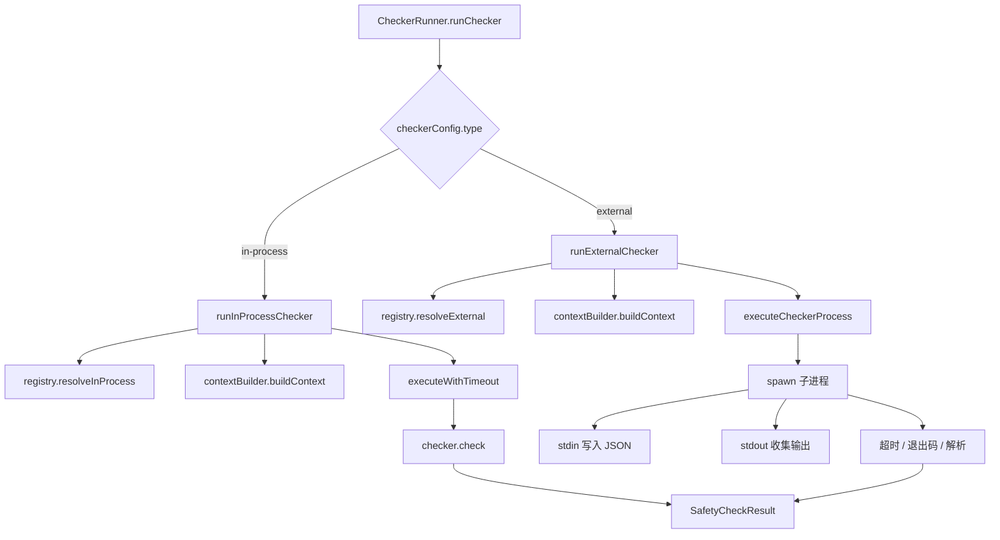

# checker-runner.ts

> 统一调度进程内和外部安全检查器的执行引擎，负责运行检查器并处理超时与错误。

## 概述

`CheckerRunner` 是安全检查子系统的执行核心，负责根据检查器配置类型（`in-process` 或 `external`）选择相应的执行路径。对于进程内检查器，直接调用其 `check` 方法；对于外部检查器，通过子进程（stdin/stdout）通信。两种执行路径都具备超时保护和错误兜底机制——任何异常情况均 fail-closed（默认拒绝）。结果通过 Zod schema 进行严格校验。

## 架构图



## 主要导出

### `interface CheckerRunnerConfig`
```typescript
{
  timeout?: number;    // 最大等待时间（毫秒），默认 5000
  checkersPath: string; // 外部检查器可执行文件所在目录
}
```

### `class CheckerRunner`
安全检查器执行服务。

**构造函数**
```typescript
constructor(
  contextBuilder: ContextBuilder,
  registry: CheckerRegistry,
  config: CheckerRunnerConfig,
)
```

**`runChecker(toolCall: FunctionCall, checkerConfig: SafetyCheckerConfig): Promise<SafetyCheckResult>`**
公开入口：根据 `checkerConfig.type` 分派到进程内或外部检查器执行流程。

## 核心逻辑

### 进程内检查器执行
1. 从 `CheckerRegistry` 获取检查器实例
2. 根据 `required_context` 构建完整或最小上下文
3. 组装 `SafetyCheckInput`（协议版本 `1.0.0`）
4. 通过 `executeWithTimeout` 附加超时保护后调用 `checker.check()`
5. 捕获异常时返回 `DENY`

### 外部检查器执行
1. 从 `CheckerRegistry` 解析可执行文件路径
2. 使用 `child_process.spawn` 启动子进程（`stdio: ['pipe', 'pipe', 'pipe']`）
3. 通过 stdin 写入 JSON 序列化的 `SafetyCheckInput`
4. 收集 stdout/stderr 输出
5. 超时处理：先发 `SIGTERM`，5秒后无响应发 `SIGKILL`
6. 进程退出后：非零退出码返回 `DENY`；零退出码则解析 stdout JSON
7. 使用 `SafetyCheckResultSchema`（Zod discriminatedUnion）严格校验输出结构

### Zod 校验 Schema
```typescript
SafetyCheckResultSchema = z.discriminatedUnion('decision', [
  z.object({ decision: z.literal('allow'), reason: z.string().optional() }),
  z.object({ decision: z.literal('deny'), reason: z.string().min(1) }),
  z.object({ decision: z.literal('ask_user'), reason: z.string().min(1) }),
])
```

### Fail-closed 策略
所有错误路径（超时、进程崩溃、输出解析失败、写入 stdin 失败等）均返回 `DENY` 决策，确保安全默认行为。

## 内部依赖

| 模块 | 用途 |
|---|---|
| `./protocol.js` | `SafetyCheckDecision`、`SafetyCheckInput`、`SafetyCheckResult` |
| `./registry.js` | `CheckerRegistry` 检查器注册表 |
| `./context-builder.js` | `ContextBuilder` 上下文构建器 |
| `../policy/types.js` | `SafetyCheckerConfig`、`InProcessCheckerConfig`、`ExternalCheckerConfig` |

## 外部依赖

| 包 | 用途 |
|---|---|
| `node:child_process` | `spawn` 启动外部检查器进程 |
| `@google/genai` | `FunctionCall` 类型 |
| `zod` | 运行时 schema 校验 |
