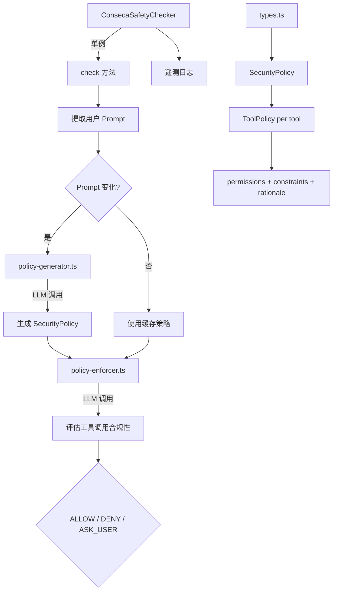

# conseca 架构

> 基于 LLM 的上下文感知内容安全检查器，通过动态生成安全策略实现最小权限原则

## 概述

`conseca`（Context-aware Security Analysis）是一个基于 LLM 的安全检查子系统。它通过两步机制运行：首先根据用户提示词和可用工具列表，使用 LLM（Gemini Flash）动态生成一份临时安全策略（Security Policy）；然后在每次工具调用时，使用另一个 LLM 调用来评估该工具调用是否符合策略。这实现了"最小权限原则"——只允许当前任务所需的最少操作权限。Conseca 作为内置检查器注册到安全检查系统中。

## 架构图



## 目录结构

```
conseca/
├── conseca.ts            # ConsecaSafetyChecker 主类（单例模式）
├── policy-generator.ts   # 安全策略生成器（LLM 调用）
├── policy-enforcer.ts    # 安全策略执行器（LLM 调用）
└── types.ts              # 类型定义
```

## 关键文件

| 文件 | 功能 |
|------|------|
| `conseca.ts` | `ConsecaSafetyChecker` 单例类，实现 `InProcessChecker` 接口。缓存当前策略和 Prompt，仅在 Prompt 变化时重新生成策略。集成遥测日志记录策略生成和判决事件 |
| `policy-generator.ts` | `generatePolicy` 函数，使用 Gemini Flash 模型根据用户 Prompt 和工具列表生成 `SecurityPolicy`。提示词指导 LLM 为每个相关工具生成 allow/deny/ask_user 策略及约束条件 |
| `policy-enforcer.ts` | `enforcePolicy` 函数，使用 Gemini Flash 模型评估具体工具调用是否符合已生成的安全策略。将策略和工具调用参数传入 LLM，返回 ALLOW/DENY/ASK_USER 决策 |
| `types.ts` | 定义 `SecurityPolicy`（工具名到 `ToolPolicy` 的映射）和 `ToolPolicy`（permissions、constraints、rationale） |

## 内部依赖

| 模块 | 用途 |
|------|------|
| `safety/built-in` | InProcessChecker 接口 |
| `safety/protocol` | SafetyCheckDecision, SafetyCheckInput/Result |
| `config/config` | Config（获取内容生成器） |
| `config/models` | DEFAULT_GEMINI_FLASH_MODEL |
| `config/agent-loop-context` | AgentLoopContext |
| `telemetry/index` | 遥测日志（ConsecaPolicyGenerationEvent, ConsecaVerdictEvent） |
| `utils/partUtils` | getResponseText 提取 LLM 响应文本 |
| `utils/textUtils` | safeTemplateReplace 模板替换 |
| `utils/debugLogger` | 调试日志 |

## 外部依赖

| 包 | 用途 |
|------|------|
| `@google/genai` | FunctionCall 类型 |
| `zod` | EnforcementResultSchema 输出验证 |
| `zod-to-json-schema` | 将 Zod schema 转为 JSON Schema |
