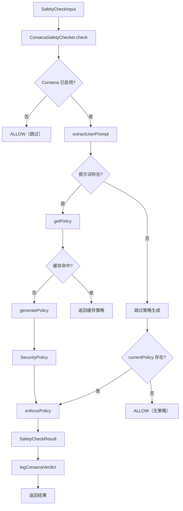

# conseca.ts

> Conseca 安全检查器的主入口，协调策略生成与策略执行，实现基于 LLM 的动态安全防护。

## 概述

`ConsecaSafetyChecker` 是 Conseca（Context-Sensitive Security for Code Agents）安全框架的核心协调器，实现了 `InProcessChecker` 接口。它采用单例模式，在接收到安全检查请求时：(1) 从对话历史中提取用户提示词；(2) 调用策略生成器根据提示词动态生成安全策略；(3) 调用策略执行器验证当前工具调用是否合规。策略按用户提示词缓存，同一提示词内多次工具调用共享同一策略，避免重复生成。

## 架构图



## 主要导出

### `class ConsecaSafetyChecker implements InProcessChecker`

**`static getInstance(): ConsecaSafetyChecker`**
获取全局单例实例。

**`static resetInstance(): void`**
重置单例（仅用于测试）。

**`setContext(context: AgentLoopContext): void`**
注入运行时上下文，包含配置和工具注册表。必须在 `check` 调用前设置。

**`check(input: SafetyCheckInput): Promise<SafetyCheckResult>`**
主检查方法，实现 `InProcessChecker` 接口。

**`getPolicy(userPrompt, trustedContent, config): Promise<SecurityPolicy>`**
获取或生成安全策略（带缓存）。

**`getCurrentPolicy(): SecurityPolicy | null`**
获取当前策略（测试辅助）。

**`getActiveUserPrompt(): string | null`**
获取当前活跃的用户提示词（测试辅助）。

## 核心逻辑

### 检查流程
1. **前置检查**：验证上下文已初始化且 Conseca 功能已启用（`config.enableConseca`）
2. **提示词提取**：从对话历史的最后一轮取用户文本
3. **工具声明收集**：从 `toolRegistry` 获取所有工具的函数声明，序列化为 JSON 作为 trusted content
4. **策略获取**：调用 `getPolicy`，若提示词与缓存匹配则复用
5. **策略执行**：调用 `enforcePolicy` 验证工具调用合规性
6. **遥测记录**：记录 `ConsecaVerdictEvent`

### 策略缓存
```typescript
if (this.activeUserPrompt === userPrompt && this.currentPolicy) {
  return this.currentPolicy;
}
```
以用户提示词为缓存键。当用户发送新提示词时自动生成新策略。

### 降级处理
- 上下文未初始化 -> `ALLOW`
- Conseca 未启用 -> `ALLOW`
- 无策略生成 -> `ALLOW`（带 error 标记）

### 遥测集成
每次检查都通过 `logConsecaVerdict` 记录完整的判定事件，包含用户提示词、策略内容、工具调用详情和决策结果。策略生成阶段通过 `logConsecaPolicyGeneration` 记录。

## 内部依赖

| 模块 | 用途 |
|---|---|
| `../built-in.js` | `InProcessChecker` 接口 |
| `../protocol.js` | `SafetyCheckDecision`、`SafetyCheckInput`、`SafetyCheckResult` |
| `./policy-generator.js` | `generatePolicy` 策略生成函数 |
| `./policy-enforcer.js` | `enforcePolicy` 策略执行函数 |
| `./types.js` | `SecurityPolicy` 类型 |
| `../../telemetry/index.js` | 遥测日志函数和事件类型 |
| `../../utils/debugLogger.js` | 调试日志 |
| `../../config/config.js` | `Config` 类型 |
| `../../config/agent-loop-context.js` | `AgentLoopContext` 类型 |

## 外部依赖

无直接外部依赖（间接通过 policy-generator 和 policy-enforcer 使用 zod 等）。
