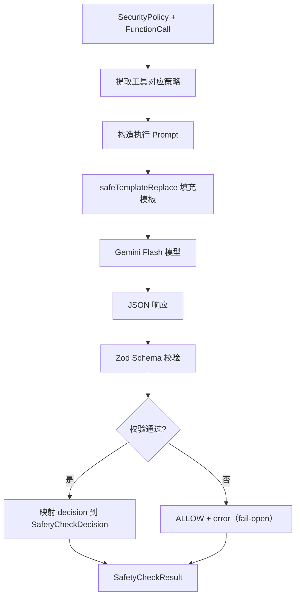

# policy-enforcer.ts

> 基于 LLM 的安全策略执行器，验证具体工具调用是否符合已生成的安全策略。

## 概述

`policy-enforcer.ts` 实现了 Conseca 安全框架的策略执行阶段。在策略生成器为当前用户请求生成安全策略后，策略执行器负责将每个具体的工具调用与对应的策略进行比对。它使用 Gemini Flash 模型作为"安全执行引擎"，评估工具调用的参数是否满足策略约束，并返回 allow/deny/ask_user 决策。

## 架构图



## 主要导出

### `async function enforcePolicy(policy, toolCall, config): Promise<SafetyCheckResult>`
策略执行的主入口函数：
- `policy`: 由策略生成器生成的 `SecurityPolicy`
- `toolCall`: 待验证的 `FunctionCall`
- `config`: 全局配置，用于获取内容生成器

## 核心逻辑

### Prompt 设计
`CONSECA_ENFORCEMENT_PROMPT` 指导 LLM 作为安全执行引擎：
1. 接收安全策略和工具调用两部分输入
2. 检查工具是否被允许
3. 检查参数是否符合约束
4. 输出 JSON：`{ decision, reason }`

### Zod Schema
```typescript
EnforcementResultSchema = z.object({
  decision: z.enum(['allow', 'deny', 'ask_user']),
  reason: z.string(),
})
```
同样使用 `zodToJsonSchema` 转换为 OpenAPI 3 格式传递给模型。

### 决策映射
将 LLM 返回的字符串决策映射为 `SafetyCheckDecision` 枚举值：
- `'allow'` -> `SafetyCheckDecision.ALLOW`
- `'deny'` -> `SafetyCheckDecision.DENY`
- `'ask_user'` -> `SafetyCheckDecision.ASK_USER`

### 错误处理策略
采用 fail-open 策略（与 policy-generator 一致）：
- 内容生成器未初始化 -> `ALLOW` + error
- 工具名缺失 -> `ALLOW` + error
- LLM 响应为空 -> `ALLOW` + error
- JSON 解析失败 -> `ALLOW` + error
- API 调用异常 -> `ALLOW` + error

> **注意**：此 fail-open 策略意味着 Conseca 执行器的失败不会阻断工具调用。这是一个设计选择，确保 Conseca 子系统的故障不影响主流程可用性。

### 策略查找
通过 `policy[toolName]` 直接查找工具对应的策略。若工具不在策略中，传入空对象 `{}`，由 LLM 自行判断。

## 内部依赖

| 模块 | 用途 |
|---|---|
| `./types.js` | `SecurityPolicy` 类型 |
| `../protocol.js` | `SafetyCheckDecision`、`SafetyCheckResult` |
| `../../config/config.js` | `Config` 类型 |
| `../../config/models.js` | `DEFAULT_GEMINI_FLASH_MODEL` |
| `../../utils/partUtils.js` | `getResponseText` |
| `../../utils/textUtils.js` | `safeTemplateReplace` |
| `../../utils/debugLogger.js` | 调试日志 |
| `../../telemetry/index.js` | `LlmRole` |

## 外部依赖

| 包 | 用途 |
|---|---|
| `@google/genai` | `FunctionCall` 类型 |
| `zod` | 运行时 schema 校验 |
| `zod-to-json-schema` | Schema 格式转换 |
