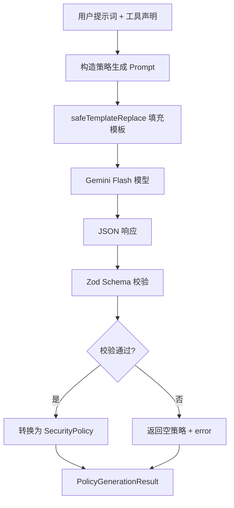

# policy-generator.ts

> 基于 LLM 的安全策略生成器，根据用户提示词和可用工具动态生成最小权限安全策略。

## 概述

`policy-generator.ts` 实现了 Conseca 安全框架的策略生成阶段。它利用 Gemini Flash 模型作为"安全专家"，根据用户的提示词和当前可用的工具声明，自动生成针对每个相关工具的细粒度安全策略。生成的策略遵循最小权限原则（Principle of Least Privilege），尽可能限制工具权限，同时确保用户任务可完成。整个过程通过结构化 JSON 输出与 Zod schema 校验保证类型安全。

## 架构图



## 主要导出

### `interface PolicyGenerationResult`
```typescript
{
  policy: SecurityPolicy;  // 生成的安全策略（可能为空对象）
  error?: string;          // 错误信息（如果生成失败）
}
```

### `async function generatePolicy(userPrompt, trustedContent, config): Promise<PolicyGenerationResult>`
策略生成的主入口函数：
- `userPrompt`: 用户的原始提示词
- `trustedContent`: JSON 格式的工具声明列表
- `config`: 全局配置，用于获取内容生成器

## 核心逻辑

### Prompt 设计
`CONSECA_POLICY_GENERATION_PROMPT` 是一个精心设计的系统提示词，指导 LLM：
1. 扮演安全专家角色
2. 为每个相关工具生成 `permissions`（allow/deny/ask_user）、`constraints`（约束条件）和 `rationale`（理由）
3. 遵循最小权限原则
4. 对破坏性操作使用 `ask_user`
5. 输出严格 JSON 格式

### Zod Schema 定义
```typescript
ToolPolicySchema = z.object({
  permissions: z.nativeEnum(SafetyCheckDecision),
  constraints: z.string(),
  rationale: z.string(),
})

SecurityPolicyResponseSchema = z.object({
  policies: z.array(z.object({
    tool_name: z.string(),
    policy: ToolPolicySchema,
  })),
})
```
使用 `zodToJsonSchema` 将 Zod schema 转换为 OpenAPI 3 格式，作为 `responseSchema` 传递给模型，确保结构化输出。

### 错误处理策略
采用 fail-open 策略：
- 内容生成器未初始化 -> 返回空策略 + error
- LLM 响应为空 -> 返回空策略 + error
- JSON 解析失败 -> 返回空策略 + error（附带原始响应）
- 网络/API 异常 -> 返回空策略 + error

### 策略转换
将 LLM 返回的数组格式 `{ tool_name, policy }[]` 转换为字典格式 `Record<string, ToolPolicy>`。

## 内部依赖

| 模块 | 用途 |
|---|---|
| `./types.js` | `SecurityPolicy` 类型 |
| `../protocol.js` | `SafetyCheckDecision` 枚举 |
| `../../config/config.js` | `Config` 类型 |
| `../../config/models.js` | `DEFAULT_GEMINI_FLASH_MODEL` 模型标识 |
| `../../utils/partUtils.js` | `getResponseText` 提取响应文本 |
| `../../utils/textUtils.js` | `safeTemplateReplace` 安全模板替换 |
| `../../utils/debugLogger.js` | 调试日志 |
| `../../telemetry/index.js` | `LlmRole` 遥测标识 |

## 外部依赖

| 包 | 用途 |
|---|---|
| `zod` | 运行时 schema 定义与校验 |
| `zod-to-json-schema` | 将 Zod schema 转换为 OpenAPI 3 JSON Schema |
