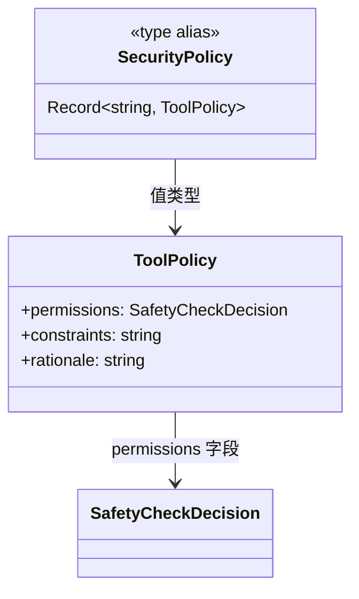

# types.ts

> 定义 Conseca 安全策略的核心类型：工具策略和安全策略映射。

## 概述

`types.ts` 是 Conseca 子模块的类型定义文件，定义了两个关键类型：`ToolPolicy`（单个工具的安全策略）和 `SecurityPolicy`（工具名到策略的映射字典）。这些类型贯穿于 Conseca 的策略生成和策略执行两个阶段，是策略流转的数据载体。

## 架构图



## 主要导出

### `interface ToolPolicy`
单个工具的安全策略：
| 字段 | 类型 | 含义 |
|---|---|---|
| `permissions` | `SafetyCheckDecision` | 工具的权限决策（allow/deny/ask_user） |
| `constraints` | `string` | 约束条件的自然语言描述（如允许的文件路径、参数限制等） |
| `rationale` | `string` | 策略制定的理由，引用用户的原始请求 |

### `type SecurityPolicy`
```typescript
type SecurityPolicy = Record<string, ToolPolicy>
```
以工具名为键、`ToolPolicy` 为值的字典类型，表示整个会话或请求的完整安全策略。

## 核心逻辑

此文件为纯类型定义文件，不含运行时逻辑。

## 内部依赖

| 模块 | 用途 |
|---|---|
| `../protocol.js` | `SafetyCheckDecision` 枚举 |

## 外部依赖

无外部依赖。
