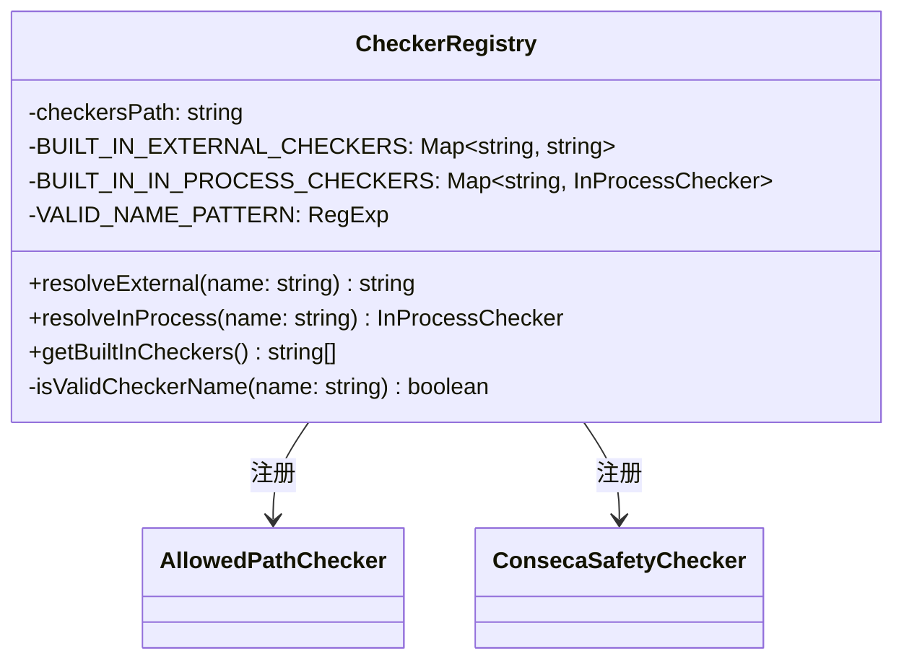

# registry.ts

> 安全检查器的注册与解析中心，管理内置进程内检查器和外部检查器的名称到实例/路径的映射。

## 概述

`CheckerRegistry` 是安全检查器的集中注册表，负责将检查器名称解析为可执行的检查器实例（进程内）或可执行文件路径（外部）。它维护了内置检查器的静态映射表，并对检查器名称进行严格的格式校验（仅允许小写字母、数字和连字符），防止路径注入等安全问题。当前内置了 `allowed-path` 和 `conseca` 两个进程内检查器。

## 架构图



## 主要导出

### `class CheckerRegistry`

**构造函数**
```typescript
constructor(private readonly checkersPath: string)
```
`checkersPath` 为外部检查器可执行文件的基础目录。

**`resolveExternal(name: string): string`**
将外部检查器名称解析为绝对路径。先校验名称格式，再查找内置外部检查器映射表。当前外部映射为空，自定义外部检查器支持待后续阶段实现。

**`resolveInProcess(name: string): InProcessChecker`**
将进程内检查器名称解析为检查器实例。当前注册了：
- `allowed-path` -> `AllowedPathChecker`
- `conseca` -> `ConsecaSafetyChecker`（单例）

**`static getBuiltInCheckers(): string[]`**
返回所有内置检查器（含外部和进程内）的名称列表。

## 核心逻辑

### 名称校验
使用正则表达式 `/^[a-z0-9-]+$/` 和 `!name.includes('..')` 双重校验，确保检查器名称不包含路径遍历字符或特殊符号。

### 懒初始化
`BUILT_IN_IN_PROCESS_CHECKERS` 使用懒加载模式（`getBuiltInInProcessCheckers`），仅在首次访问时创建实例映射，避免模块加载时的副作用。

### 单例管理
`ConsecaSafetyChecker` 通过 `getInstance()` 获取单例，确保整个应用生命周期中只有一个实例。

## 内部依赖

| 模块 | 用途 |
|---|---|
| `./built-in.js` | `InProcessChecker` 接口、`AllowedPathChecker` 类 |
| `../policy/types.js` | `InProcessCheckerType` 枚举（检查器名称常量） |
| `./conseca/conseca.js` | `ConsecaSafetyChecker` 类 |

## 外部依赖

| 包 | 用途 |
|---|---|
| `node:path` | 路径拼接 |
| `node:fs` | 文件存在性检查 |
