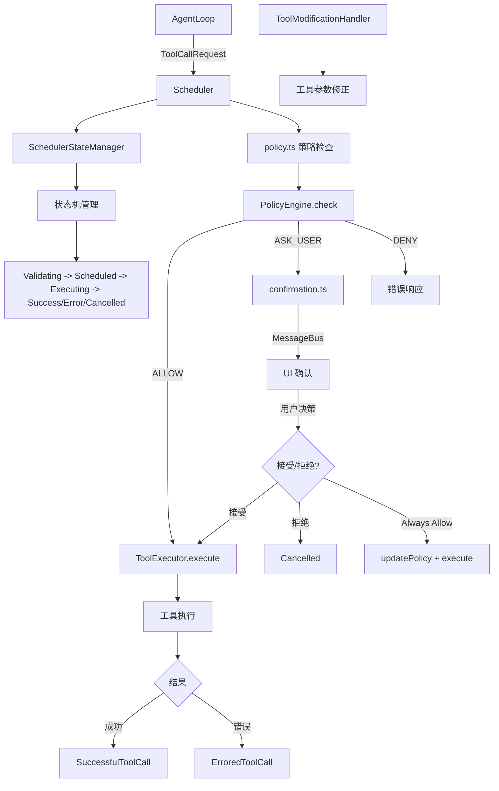

# scheduler 架构

> 工具调用调度器，管理工具调用的完整生命周期：验证、确认、执行和状态管理

## 概述

`scheduler` 模块是 Gemini CLI 的工具调用执行中枢。当 LLM 返回工具调用请求时，Scheduler 负责：(1) 查找匹配的工具定义并验证参数；(2) 通过 PolicyEngine 检查权限；(3) 如需用户确认则通过 MessageBus 发送确认请求；(4) 执行工具并收集结果；(5) 管理工具调用的完整状态机（Validating -> Scheduled -> Executing -> Success/Error/Cancelled）。Scheduler 同时支持并行工具调用和顺序执行队列。

## 架构图



## 目录结构

```
scheduler/
├── scheduler.ts         # 调度器主类
├── types.ts             # 工具调用状态机类型定义
├── state-manager.ts     # 状态管理器
├── policy.ts            # 策略检查集成
├── confirmation.ts      # 用户确认流程
├── tool-executor.ts     # 工具执行器
└── tool-modifier.ts     # 工具参数修改处理
```

## 关键文件

| 文件 | 功能 |
|------|------|
| `scheduler.ts` | `Scheduler` 类，工具调用的完整生命周期管理。接收 `ToolCallRequestInfo[]`，依次完成工具查找、参数验证、策略检查、确认、执行、遥测记录。支持顺序队列和 Tail Tool Call（工具链式调用） |
| `types.ts` | 定义工具调用状态机类型：`CoreToolCallStatus` 枚举（Validating/Scheduled/Error/Success/Executing/Cancelled/AwaitingApproval），以及各状态对应的类型（ValidatingToolCall, ExecutingToolCall 等）。定义 `ToolCallRequestInfo` 和 `ToolCallResponseInfo` |
| `state-manager.ts` | `SchedulerStateManager` 管理工具调用的状态转换和查询，维护当前所有工具调用的状态列表 |
| `policy.ts` | `checkPolicy` 集成 PolicyEngine 进行权限检查，`updatePolicy` 处理 "Always Allow" 的策略更新，`getPolicyDenialError` 生成拒绝错误信息 |
| `confirmation.ts` | `resolveConfirmation` 通过 MessageBus 发送确认请求，处理 UI 的 accept/reject/always-allow 响应 |
| `tool-executor.ts` | `ToolExecutor` 类，实际执行工具调用，处理中止信号、实时输出更新、MCP 进度通知 |
| `tool-modifier.ts` | `ToolModificationHandler` 处理工具参数的运行时修改（如路径修正） |

## 内部依赖

| 模块 | 用途 |
|------|------|
| `policy/types` | PolicyDecision, ApprovalMode |
| `policy/policy-engine` | PolicyEngine（通过 context） |
| `tools/tools` | AnyDeclarativeTool, ToolConfirmationOutcome |
| `tools/tool-error` | ToolErrorType |
| `tools/tool-registry` | ToolRegistry（通过 context） |
| `confirmation-bus` | MessageBus, ToolConfirmationRequest/Response |
| `telemetry/loggers` | logToolCall 遥测 |
| `telemetry/trace` | runInDevTraceSpan 追踪 |
| `utils/toolCallContext` | runWithToolCallContext 上下文传播 |
| `utils/events` | coreEvents 事件总线 |
| `utils/tool-utils` | getToolSuggestion 工具建议 |

## 外部依赖

| 包 | 用途 |
|------|------|
| `@google/genai` | Part 类型 |
