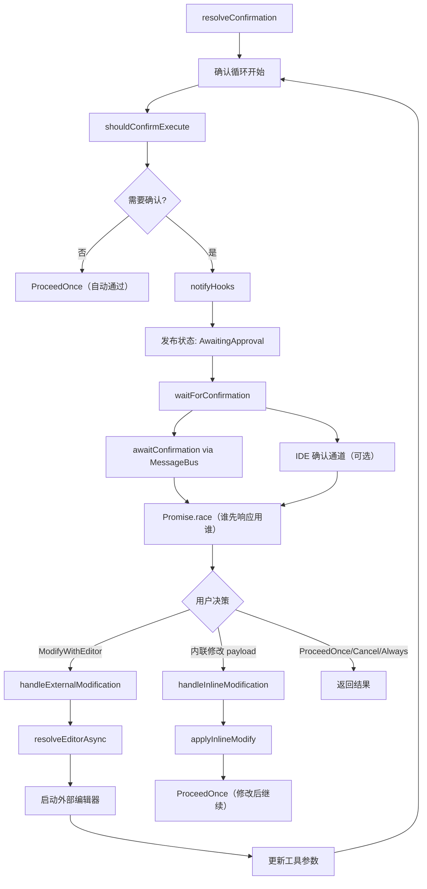

# confirmation.ts

> 管理工具调用的用户确认交互流程，支持 MessageBus、IDE 双通道确认及外部编辑器/内联修改。

## 概述

`confirmation.ts` 实现了工具调用执行前的用户确认机制。当安全策略要求用户确认（`ASK_USER`）时，此模块负责：(1) 获取工具的确认详情；(2) 通过 MessageBus 或 IDE 通道等待用户响应；(3) 处理用户的修改请求（外部编辑器或内联编辑）。整个确认流程设计为一个循环，允许用户反复修改参数并预览差异，直到最终确认或取消。

## 架构图



## 主要导出

### `interface ConfirmationResult`
```typescript
{
  outcome: ToolConfirmationOutcome;
  payload?: ToolConfirmationPayload;
}
```

### `interface ResolutionResult`
```typescript
{
  outcome: ToolConfirmationOutcome;
  lastDetails?: SerializableConfirmationDetails;
}
```

### `async function resolveConfirmation(toolCall, signal, deps): Promise<ResolutionResult>`
确认流程的主入口，管理完整的确认-修改循环。

参数 `deps` 包含：
- `config`: 全局配置
- `messageBus`: 消息总线
- `state`: 状态管理器
- `modifier`: 工具修改处理器
- `getPreferredEditor`: 获取首选编辑器
- `schedulerId`: 调度器 ID
- `onWaitingForConfirmation?`: 等待状态回调

## 核心逻辑

### 确认循环
`resolveConfirmation` 使用 `while` 循环实现"修改-预览-确认"的迭代过程：
1. 获取工具的确认详情（`shouldConfirmExecute`）
2. 触发 Hook 通知
3. 生成 `correlationId`，发布 `AwaitingApproval` 状态
4. 等待用户响应
5. 根据用户决策：
   - `ModifyWithEditor`: 启动外部编辑器修改参数，回到循环顶部
   - 内联修改（payload 含 `newContent`）: 应用修改后直接继续
   - 其他决策: 退出循环返回

### 双通道等待：`waitForConfirmation`
同时监听 MessageBus（TUI）和 IDE 两个确认通道：
1. 创建 `raceController` 用于中止失败方的监听
2. 使用 `Promise.race` 竞争两个通道
3. IDE 通道错误时静默降级为只等待 MessageBus
4. 通过 `finally` 清理所有监听器，防止内存泄漏

### MessageBus 等待：`awaitConfirmation`
使用 Node.js `events.on` 的异步迭代器模式监听 `TOOL_CONFIRMATION_RESPONSE` 事件：
- 按 `correlationId` 匹配响应
- 通过 `AbortSignal` 管理生命周期，防止"僵尸"监听器
- 支持旧版 `confirmed` 布尔字段的向后兼容

### 外部编辑器修改：`handleExternalModification`
1. 解析首选编辑器（`resolveEditorAsync`）
2. 如果编辑器不可用，返回错误信息（通过 `coreEvents.emitFeedback` 通知用户），循环继续回到之前的确认界面
3. 调用 `modifier.handleModifyWithEditor` 启动编辑器
4. 更新工具参数和调用实例

### 内联修改：`handleInlineModification`
处理来自 IDE 或 TUI 的内联内容更新，直接应用到工具参数。

## 内部依赖

| 模块 | 用途 |
|---|---|
| `./types.js` | `ValidatingToolCall`、`WaitingToolCall`、`CoreToolCallStatus` |
| `./state-manager.js` | `SchedulerStateManager` |
| `./tool-modifier.js` | `ToolModificationHandler` |
| `../confirmation-bus/message-bus.js` | `MessageBus` |
| `../confirmation-bus/types.js` | `MessageBusType`、`ToolConfirmationResponse`、`SerializableConfirmationDetails` |
| `../tools/tools.js` | `ToolConfirmationOutcome`、`ToolConfirmationPayload`、`ToolCallConfirmationDetails` |
| `../config/config.js` | `Config` |
| `../utils/editor.js` | `resolveEditorAsync`、`EditorType`、`NO_EDITOR_AVAILABLE_ERROR` |
| `../ide/ide-client.js` | `DiffUpdateResult` |
| `../utils/debugLogger.js` | 调试日志 |
| `../utils/events.js` | `coreEvents` 事件发射器 |

## 外部依赖

| 包 | 用途 |
|---|---|
| `node:events` | `on` 异步迭代器 |
| `node:crypto` | `randomUUID` 生成 correlationId |
