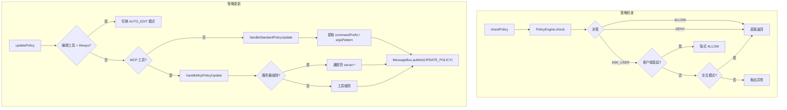

# policy.ts

> 工具调用的策略检查与策略更新逻辑，连接 PolicyEngine 与用户确认结果。

## 概述

`policy.ts` 是调度器与策略引擎之间的桥梁模块，提供三个核心功能：(1) `checkPolicy` 查询策略引擎判定工具调用是否允许执行；(2) `updatePolicy` 根据用户确认结果更新策略配置（如"总是允许"）；(3) `getPolicyDenialError` 格式化策略拒绝的错误信息。此模块还处理了客户端发起的工具调用（如斜杠命令）的特殊逻辑——隐式视为已获用户确认。

## 架构图

## 主要导出

### `function getPolicyDenialError(config, rule?): { errorMessage, errorType }`
格式化策略拒绝错误。如果策略规则包含自定义 `denyMessage`，会附加到错误消息中。

### `async function checkPolicy(toolCall, config, subagent?): Promise<CheckResult>`
查询策略引擎，判定工具调用是否被允许。
- 对 MCP 工具自动提取 `serverName`
- 传递工具注解（`toolAnnotations`）
- 客户端发起的调用在 `ASK_USER` 时自动提升为 `ALLOW`
- 非交互模式下 `ASK_USER` 会抛出异常

### `async function updatePolicy(tool, outcome, confirmationDetails, context, messageBus, toolInvocation?): Promise<void>`
根据用户确认结果更新策略。处理三种场景：
1. **AUTO_EDIT 模式切换**：编辑工具 + `ProceedAlways` -> 切换会话审批模式
2. **MCP 工具策略更新**：支持工具级别和服务器级别（通配符）的永久/会话策略
3. **标准工具策略更新**：提取命令前缀或文件路径模式，发布策略更新事件

## 核心逻辑

### 持久化范围决策
当用户选择 `ProceedAlwaysAndSave`（永久保存）时：
- 如果当前目录受信任且启用了工作区策略 -> `workspace` 范围
- 否则 -> `user` 范围

### 标准工具策略提取
- **Shell 工具**（`exec` 类型确认详情）：提取 `rootCommands` 作为命令前缀
- **编辑工具**（`edit` 类型确认详情）：将文件路径转换为相对路径后构建 `argsPattern`
- 工具调用自身也可通过 `getPolicyUpdateOptions()` 提供自定义选项

### MCP 工具策略更新
支持多种确认结果：
- `ProceedAlways` / `ProceedAlwaysTool`: 工具级别会话策略
- `ProceedAlwaysServer`: 服务器级别通配符策略（`server:*`）
- `ProceedAlwaysAndSave`: 持久化策略

## 内部依赖

| 模块 | 用途 |
|---|---|
| `./types.js` | `ValidatingToolCall` |
| `../tools/tool-error.js` | `ToolErrorType` |
| `../tools/tools.js` | `ToolConfirmationOutcome`、`AnyDeclarativeTool`、`PolicyUpdateOptions` |
| `../tools/mcp-tool.js` | `DiscoveredMCPTool`、`formatMcpToolName` |
| `../tools/tool-names.js` | `EDIT_TOOL_NAMES` |
| `../policy/types.js` | `ApprovalMode`、`PolicyDecision`、`CheckResult`、`PolicyRule` |
| `../policy/utils.js` | `buildFilePathArgsPattern` |
| `../utils/paths.js` | `makeRelative` |
| `../config/config.js` | `Config` |
| `../config/agent-loop-context.js` | `AgentLoopContext` |
| `../confirmation-bus/message-bus.js` | `MessageBus` |
| `../confirmation-bus/types.js` | `MessageBusType`、`SerializableConfirmationDetails` |

## 外部依赖

无直接外部依赖。
