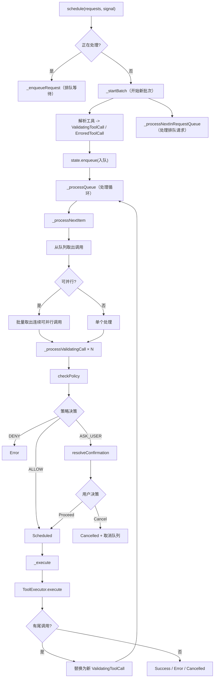

# scheduler.ts

> 工具调用的事件驱动编排器，协调策略检查、用户确认、并行执行和尾调用的完整生命周期。

## 概述

`Scheduler` 是工具调用执行的顶层编排器，实现了从工具调用请求到结果返回的完整流水线。它采用事件驱动架构，通过状态更新和事件监听协调各阶段的执行。核心特性包括：批量调度、并行执行、请求排队、策略检查、用户确认循环、尾调用链和 MCP 进度追踪。整个流水线分为三个阶段：摄入与解析（Ingestion & Resolution）、处理循环（Processing Loop）和单调用编排（Single Call Orchestration）。

## 架构图



## 主要导出

### `interface SchedulerOptions`
```typescript
{
  context: AgentLoopContext;
  messageBus?: MessageBus;
  getPreferredEditor: () => EditorType | undefined;
  schedulerId: string;
  subagent?: string;
  parentCallId?: string;
  onWaitingForConfirmation?: (waiting: boolean) => void;
}
```

### `class Scheduler`

**`schedule(request, signal): Promise<CompletedToolCall[]>`**
调度一个或多个工具调用请求。如果当前有批次正在处理，则入队等待。

**`cancelAll(): void`**
取消所有活跃和排队的调用。

**`get completedCalls: CompletedToolCall[]`**
获取已完成的调用列表。

**`dispose(): void`**
清理事件监听器。

## 核心逻辑

### 批量调度与排队
- 新请求到达时，如果已有批次在处理（`isProcessing` 或 `state.isActive`），则将请求入队
- 入队的请求通过 `Promise` 封装，调用方获得一个会在批次完成时解析的 Promise
- 支持 `AbortSignal` 取消排队中的请求

### 摄入与解析（Phase 1）
`_startBatch` 将原始请求转换为类型化的工具调用：
1. 从 `toolRegistry` 查找工具定义
2. 工具不存在 -> `ErroredToolCall`（附带相似名称建议）
3. 工具存在 -> 尝试 `tool.build(args)` 构建调用实例
4. 构建失败 -> `ErroredToolCall`（参数无效）
5. 构建成功 -> `ValidatingToolCall`

### 处理循环（Phase 2）
`_processQueue` 和 `_processNextItem` 实现主循环：
1. **取出调用**：如果第一个调用可并行化，批量取出所有连续可并行调用
2. **验证阶段**：并行处理所有 `Validating` 状态的调用
3. **执行阶段**：仅当所有活跃调用都处于就绪状态时才执行 `Scheduled` 调用
4. **终态处理**：将终态调用移入已完成批次
5. **外部等待**：若有调用在等待外部事件（审批或执行中），让出事件循环

### 并行化判断
```typescript
_isParallelizable(request): boolean
```
检查 `args.wait_for_previous` 字段。如果为 `true` 则顺序执行，否则默认并行。

### 单调用编排（Phase 3）
`_processToolCall` 处理单个工具调用的完整流程：
1. **策略检查**：`checkPolicy` -> DENY/ALLOW/ASK_USER
2. **用户确认**：ASK_USER 时调用 `resolveConfirmation`
3. **策略更新**：根据确认结果更新策略
4. **取消级联**：用户取消时同时取消所有排队调用

### 尾调用链
工具执行完成后如果返回 `tailToolCallRequest`，会：
1. 记录中间结果的遥测日志
2. 创建新的工具调用（ValidatingToolCall 或 ErroredToolCall）
3. 通过 `replaceActiveCallWithTailCall` 替换当前调用
4. 返回 `true` 使循环继续处理新调用

### MCP 进度追踪
通过 `coreEvents.on(CoreEvent.McpProgress, ...)` 监听 MCP 工具的进度更新，将进度信息（消息、百分比、绝对值）合并到 `ExecutingToolCall` 状态。

### MessageBus 兼容层
`setupMessageBusListener` 注册一个向后兼容的监听器，对遗留的 `TOOL_CONFIRMATION_REQUEST` 自动回复拒绝（因为调度器已接管确认流程）。使用 `WeakSet` 防止同一 MessageBus 重复注册。

## 内部依赖

| 模块 | 用途 |
|---|---|
| `./state-manager.js` | `SchedulerStateManager` |
| `./confirmation.js` | `resolveConfirmation` |
| `./policy.js` | `checkPolicy`、`updatePolicy`、`getPolicyDenialError` |
| `./tool-executor.js` | `ToolExecutor` |
| `./tool-modifier.js` | `ToolModificationHandler` |
| `./types.js` | 全部工具调用状态类型 |
| `../tools/tool-error.js` | `ToolErrorType` |
| `../tools/tools.js` | 工具相关类型 |
| `../policy/types.js` | `PolicyDecision`、`ApprovalMode` |
| `../config/config.js` | `Config` |
| `../config/agent-loop-context.js` | `AgentLoopContext` |
| `../confirmation-bus/message-bus.js` | `MessageBus` |
| `../confirmation-bus/types.js` | 消息类型 |
| `../utils/tool-utils.js` | `getToolSuggestion` |
| `../utils/toolCallContext.js` | `runWithToolCallContext` |
| `../utils/events.js` | `coreEvents`、`CoreEvent` |
| `../utils/editor.js` | `EditorType` |
| `../telemetry/trace.js` | `runInDevTraceSpan` |
| `../telemetry/loggers.js` | `logToolCall` |
| `../telemetry/types.js` | `ToolCallEvent` |
| `../telemetry/constants.js` | `GeminiCliOperation` |

## 外部依赖

无直接外部依赖。
