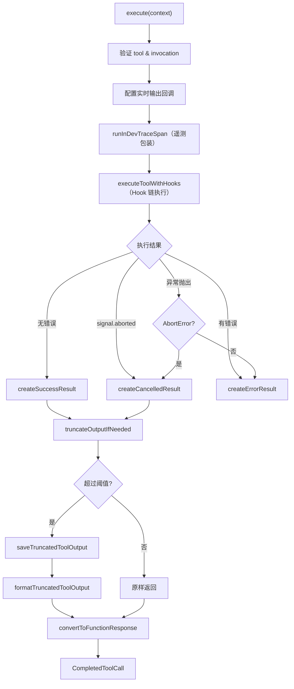

# tool-executor.ts

> 工具调用的实际执行引擎，处理执行、输出截断、结果构建和错误恢复。

## 概述

`ToolExecutor` 负责工具调用的最终执行阶段：启动工具、收集结果、截断过长输出、构建标准化响应。它封装了与工具执行框架（Hook 系统）的交互，处理执行成功、失败和取消三种终态，并特别针对 Shell 工具和 MCP 工具实现了输出截断逻辑——当输出超过阈值时自动保存完整输出到临时文件并返回截断版本。

## 架构图



## 主要导出

### `interface ToolExecutionContext`
```typescript
{
  call: ToolCall;
  signal: AbortSignal;
  outputUpdateHandler?: (callId: string, output: ToolLiveOutput) => void;
  onUpdateToolCall: (updatedCall: ToolCall) => void;
}
```

### `class ToolExecutor`

**构造函数**
```typescript
constructor(private readonly context: AgentLoopContext)
```

**`execute(context: ToolExecutionContext): Promise<CompletedToolCall>`**
执行单个工具调用，返回终态结果。

## 核心逻辑

### 执行流程
1. **前置校验**：确保 `call` 包含 `tool` 和 `invocation`
2. **实时输出**：如果工具支持输出更新（`canUpdateOutput`），设置回调
3. **遥测包装**：通过 `runInDevTraceSpan` 记录执行跨度
4. **PID 回调**：设置 `setExecutionIdCallback` 用于记录进程 ID（Shell 工具）
5. **Hook 链执行**：调用 `executeToolWithHooks` 执行工具
6. **结果分支**：
   - 信号已中止 -> `CancelledToolCall`
   - 无错误 -> `SuccessfulToolCall`
   - 有错误 -> `ErroredToolCall`（支持 `tailToolCallRequest`）
   - 异常抛出 -> 区分 `AbortError`（取消）和其他异常（错误）

### 输出截断：`truncateOutputIfNeeded`
针对两种场景进行输出截断：

**Shell 工具**：
- 当输出为字符串且长度超过 `truncateToolOutputThreshold` 时触发
- 完整输出保存到项目临时目录
- 返回截断后的格式化文本（含文件路径引用）

**MCP 工具**：
- 当输出为单元素 Part 数组且文本超过阈值时触发
- 同样保存完整输出到临时文件
- 创建新的 Part 数组（避免修改原始数据）

两种场景都会通过 `logToolOutputTruncated` 记录遥测事件。

### 结果构建
三个私有方法分别构建三种终态：

**`createSuccessResult`**：截断输出 -> 转换为 `FunctionResponse` -> 构建 `SuccessfulToolCall`（含 `tailToolCallRequest`）

**`createCancelledResult`**：如果有已产生的输出（取消前），也进行截断保存；注入取消错误到响应体

**`createErrorResult`**：构建错误响应，支持 `returnDisplay`（自定义显示文本）和 `tailToolCallRequest`

## 内部依赖

| 模块 | 用途 |
|---|---|
| `./types.js` | 工具调用状态类型 |
| `../index.js` | 聚合导入（`ToolErrorType`、`ToolCallRequestInfo`、`Config` 等） |
| `../utils/errors.js` | `isAbortError` |
| `../utils/fileUtils.js` | `saveTruncatedToolOutput`、`formatTruncatedToolOutput` |
| `../utils/generateContentResponseUtilities.js` | `convertToFunctionResponse` |
| `../tools/tool-names.js` | `SHELL_TOOL_NAME` |
| `../tools/mcp-tool.js` | `DiscoveredMCPTool` |
| `../core/coreToolHookTriggers.js` | `executeToolWithHooks` |
| `../telemetry/constants.js` | `GeminiCliOperation`、遥测属性常量 |

## 外部依赖

| 包 | 用途 |
|---|---|
| `@google/genai` | `PartListUnion`、`Part` 类型 |
