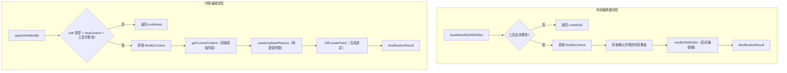

# tool-modifier.ts

> 处理工具调用参数的用户修改，支持外部编辑器和内联编辑两种修改方式。

## 概述

`ToolModificationHandler` 提供了两种修改工具调用参数的途径：(1) 通过外部编辑器（如 Vim）启动编辑会话，让用户在编辑器中修改工具的输入内容；(2) 通过内联方式接收来自 IDE 或 TUI 的新内容并直接应用。两种方式都利用了工具的 `ModifyContext` 接口，该接口由支持修改的工具自行实现，定义了如何提取当前内容、如何从新内容构建更新后的参数。

## 架构图



## 主要导出

### `interface ModificationResult`
```typescript
{
  updatedParams: Record<string, unknown>;  // 更新后的工具参数
  updatedDiff?: string;                     // 可选的 unified diff 字符串
}
```

### `class ToolModificationHandler`

**`handleModifyWithEditor(toolCall, editorType, signal): Promise<ModificationResult | undefined>`**
外部编辑器修改流程：
1. 检查工具是否实现 `isModifiableDeclarativeTool`
2. 获取工具的 `ModifyContext`
3. 如果是 `edit` 类型确认，提供原始内容和提议内容作为覆盖
4. 调用 `modifyWithEditor` 启动编辑器会话
5. 返回更新后的参数和差异

**`applyInlineModify(toolCall, payload, signal): Promise<ModificationResult | undefined>`**
内联修改流程：
1. 校验确认详情为 `edit` 类型且 payload 包含 `newContent`
2. 获取工具的 `ModifyContext`
3. 通过 `getCurrentContent` 获取当前内容
4. 通过 `createUpdatedParams` 构建新参数
5. 使用 `Diff.createPatch` 生成 unified diff

## 核心逻辑

### 工具可修改性检查
两个方法都先调用 `isModifiableDeclarativeTool` 类型守卫检查工具是否支持修改操作。不支持的工具直接返回 `undefined`，调用方会跳过修改步骤。

### 外部编辑器的内容覆盖
对于 `edit` 类型的确认（文件编辑工具），会将确认详情中的 `originalContent` 和 `newContent` 传递给编辑器：
- `currentContent`: 文件的原始内容
- `proposedContent`: 工具提议的新内容
编辑器会展示这些内容，让用户在此基础上修改。

### Diff 生成
内联修改使用 `Diff.createPatch` 生成 unified diff：
```typescript
Diff.createPatch(filePath, currentContent, newContent, 'Current', 'Proposed')
```
生成的差异可用于 UI 展示变更预览。

## 内部依赖

| 模块 | 用途 |
|---|---|
| `./types.js` | `WaitingToolCall` |
| `../utils/editor.js` | `EditorType` |
| `../tools/modifiable-tool.js` | `isModifiableDeclarativeTool`、`modifyWithEditor`、`ModifyContext` |
| `../tools/tools.js` | `ToolConfirmationPayload` |

## 外部依赖

| 包 | 用途 |
|---|---|
| `diff` | `Diff.createPatch` 生成 unified diff |
