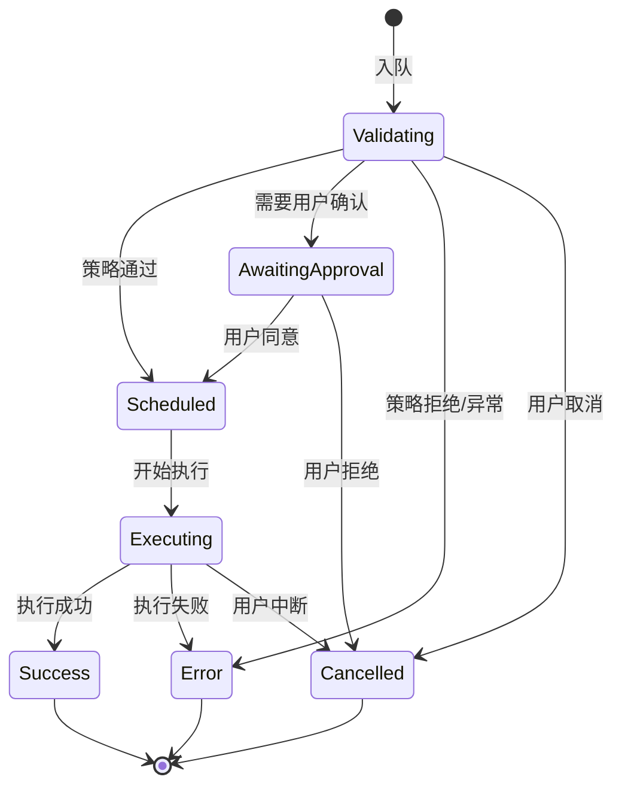

# types.ts

> 定义工具调用调度器的完整类型系统：状态机枚举、各阶段的工具调用类型和处理器回调签名。

## 概述

`types.ts` 是 scheduler 模块的类型基础设施，定义了工具调用从发起到完成的完整生命周期类型。核心是 `CoreToolCallStatus` 枚举，它定义了 7 种状态（验证中、已排期、执行中、等待审批、成功、失败、已取消），以及与每种状态对应的类型化工具调用结构。通过 TypeScript 的可辨识联合（Discriminated Union），在编译期保证不同状态下可访问的字段。

## 架构图

## 主要导出

### `const ROOT_SCHEDULER_ID = 'root'`
根调度器的标识符常量。

### `enum CoreToolCallStatus`
工具调用的 7 种核心状态：
| 值 | 含义 |
|---|---|
| `Validating` | 验证中（策略检查、安全检查） |
| `Scheduled` | 已排期，等待执行 |
| `Executing` | 正在执行 |
| `AwaitingApproval` | 等待用户审批 |
| `Success` | 执行成功 |
| `Error` | 执行失败 |
| `Cancelled` | 已取消 |

### `interface ToolCallRequestInfo`
工具调用请求信息：
- `callId`: 唯一标识
- `name`: 工具名称
- `args`: 参数字典
- `originalRequestName?`: 原始工具名（用于尾调用保留原始名称）
- `isClientInitiated`: 是否由客户端发起（如斜杠命令）
- `prompt_id`: 关联的提示词 ID
- `schedulerId?`, `parentCallId?`: 调度器和父调用链路

### `interface ToolCallResponseInfo`
工具调用响应信息：
- `callId`: 对应的调用 ID
- `responseParts`: 返回给模型的 Part 列表
- `resultDisplay`: 用于 UI 显示的结果
- `error`/`errorType`: 错误信息
- `outputFile?`: 截断输出保存的文件路径
- `data?`: 可选的结构化数据负载

### `interface TailToolCallRequest`
尾调用请求，用于在工具完成后立即触发另一个工具。

### 状态类型（可辨识联合成员）
| 类型 | 状态 | 关键字段 |
|---|---|---|
| `ValidatingToolCall` | Validating | `tool`, `invocation`, `startTime` |
| `ScheduledToolCall` | Scheduled | `tool`, `invocation` |
| `ExecutingToolCall` | Executing | `tool`, `invocation`, `liveOutput`, `pid`, `progress*` |
| `WaitingToolCall` | AwaitingApproval | `tool`, `invocation`, `confirmationDetails`, `correlationId` |
| `SuccessfulToolCall` | Success | `tool`, `response`, `durationMs`, `tailToolCallRequest` |
| `ErroredToolCall` | Error | `response`, `tool?`（可能不存在，如工具未找到） |
| `CancelledToolCall` | Cancelled | `tool`, `response`, `durationMs` |

### 联合类型
- `ToolCall`: 所有 7 种状态的联合
- `CompletedToolCall`: 终态的联合（Success | Error | Cancelled）
- `Status`: `ToolCall['status']` 的类型别名

### 回调类型
- `ConfirmHandler`: 确认处理器
- `OutputUpdateHandler`: 实时输出更新处理器
- `AllToolCallsCompleteHandler`: 批量完成处理器
- `ToolCallsUpdateHandler`: 状态更新处理器

## 核心逻辑

此文件为纯类型定义文件，不含运行时逻辑。其设计要点：

1. **可辨识联合**：以 `status` 字段为判别器，不同状态携带不同的字段集合
2. **终态与非终态分离**：`CompletedToolCall` 联合仅含终态类型，便于类型安全的结果处理
3. **可选字段**：`tool?` 在 `ErroredToolCall` 中可选，因为工具未找到时无法关联工具实例
4. **进度追踪**：`ExecutingToolCall` 包含完整的进度信息（消息、百分比、绝对值）

## 内部依赖

| 模块 | 用途 |
|---|---|
| `../tools/tools.js` | 工具相关类型（`AnyDeclarativeTool`、`AnyToolInvocation`、`ToolCallConfirmationDetails` 等） |
| `../tools/tool-error.js` | `ToolErrorType` 错误类型枚举 |
| `../confirmation-bus/types.js` | `SerializableConfirmationDetails` |
| `../policy/types.js` | `ApprovalMode` |

## 外部依赖

| 包 | 用途 |
|---|---|
| `@google/genai` | `Part` 类型 |
