# services 架构

> 核心业务服务层，提供聊天压缩、上下文管理、文件系统、Git、Shell 执行等基础设施服务

## 概述

`services` 模块包含 Gemini CLI 的各类业务服务实现。这些服务为上层的 AgentLoop 和工具提供具体功能：聊天历史压缩、对话录制、上下文管理（GEMINI.md 文件层级发现）、环境变量脱敏、文件系统操作、Git 集成、Shell 命令执行、密钥链管理、循环检测、模型配置、沙箱管理、会话摘要、工具输出脱敏、任务跟踪器等。每个服务独立封装特定领域的逻辑。

## 架构图

```mermaid
graph TD
    A[AgentLoop] --> B[chatCompressionService]
    A --> C[contextManager]
    A --> D[executionLifecycleService]
    A --> E[loopDetectionService]
    A --> F[sessionSummaryService]

    G[工具层] --> H[fileSystemService]
    G --> I[gitService]
    G --> J[shellExecutionService]
    G --> K[trackerService]

    L[配置层] --> M[modelConfigService]
    L --> N[keychainService]
    L --> O[sandboxManager]

    P[安全层] --> Q[environmentSanitization]
    P --> R[toolOutputMaskingService]
    P --> S[FolderTrustDiscoveryService]

    T[发现层] --> U[fileDiscoveryService]
    T --> V[fileKeychain]
```



## 目录结构

```
services/
├── chatCompressionService.ts        # 聊天历史压缩服务
├── chatRecordingService.ts          # 对话录制服务
├── contextManager.ts                # 上下文管理器（GEMINI.md 层级加载）
├── environmentSanitization.ts       # 环境变量脱敏
├── executionLifecycleService.ts     # 执行生命周期管理
├── fileDiscoveryService.ts          # 文件发现服务
├── fileKeychain.ts                  # 文件密钥链
├── fileSystemService.ts             # 文件系统操作服务
├── FolderTrustDiscoveryService.ts   # 文件夹信任发现服务
├── gitService.ts                    # Git 操作服务
├── keychainService.ts               # 系统密钥链服务
├── keychainTypes.ts                 # 密钥链类型定义
├── loopDetectionService.ts          # 循环检测服务
├── modelConfigService.ts            # 模型配置服务
├── sandboxManager.ts                # 沙箱管理器
├── sessionSummaryService.ts         # 会话摘要服务
├── sessionSummaryUtils.ts           # 会话摘要工具函数
├── shellExecutionService.ts         # Shell 命令执行服务
├── toolOutputMaskingService.ts      # 工具输出脱敏服务
├── trackerService.ts                # 任务跟踪器服务
└── trackerTypes.ts                  # 任务跟踪器类型定义
```

## 关键文件

| 文件 | 功能 |
|------|------|
| `chatCompressionService.ts` | 当对话历史过长时，使用 LLM 压缩早期对话为摘要，减少 token 消耗 |
| `contextManager.ts` | `ContextManager` 管理三层 GEMINI.md 文件（全局 -> 扩展 -> 项目），支持刷新、JIT 子目录加载、层级记忆合并 |
| `shellExecutionService.ts` | `ShellExecutionService` 管理 Shell 命令执行，支持 PTY/非 PTY 模式、超时控制、输出流处理、后台进程 |
| `gitService.ts` | `GitService` 提供 Git 操作封装（diff、log、branch 等） |
| `fileSystemService.ts` | 文件读写操作的抽象服务层 |
| `loopDetectionService.ts` | 检测 LLM 是否陷入重复操作循环 |
| `sandboxManager.ts` | `SandboxManager` 管理沙箱环境，为工具执行提供安全隔离 |
| `environmentSanitization.ts` | 脱敏环境变量，防止敏感信息泄露到 LLM |
| `toolOutputMaskingService.ts` | 脱敏工具执行输出中的敏感信息 |
| `trackerService.ts` | 任务跟踪器服务，管理任务创建、更新、依赖关系和可视化 |
| `modelConfigService.ts` | 模型配置查询服务（token 限制、特性支持等） |
| `FolderTrustDiscoveryService.ts` | 检查工作区目录是否可信（影响工作区策略和技能加载） |

## 内部依赖

| 模块 | 用途 |
|------|------|
| `config/config` | Config 配置接口 |
| `config/storage` | Storage 存储路径 |
| `utils/memoryDiscovery` | GEMINI.md 文件发现 |
| `utils/events` | coreEvents 事件总线 |
| `utils/debugLogger` | 调试日志 |
| `telemetry` | 遥测日志 |

## 外部依赖

| 包 | 用途 |
|------|------|
| `node:child_process` | Shell 命令执行 |
| `node:fs` | 文件系统操作 |
| `node:crypto` | 密钥和哈希 |
