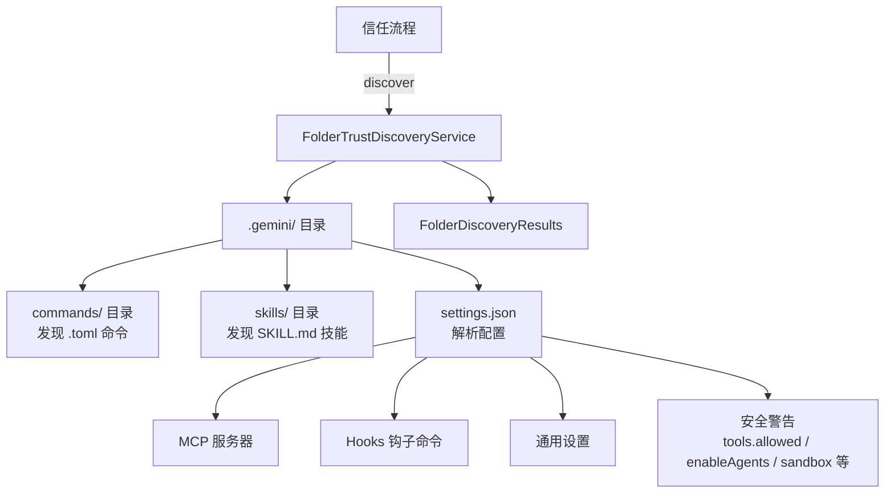

# FolderTrustDiscoveryService.ts

> 文件夹信任发现服务，在信任目录之前安全地扫描其本地配置（命令、MCP、钩子、技能等）。

## 概述

`FolderTrustDiscoveryService` 是一个安全的只读服务，用于在用户信任某个工作区目录之前，先扫描其中的 `.gemini/` 配置目录，发现其中包含的命令、MCP 服务器、钩子、技能和设置。扫描结果用于向用户展示该目录可能带来的安全影响（如自动批准工具、启用自主代理、禁用沙箱等），帮助用户做出信任决策。该模块在架构中属于安全层的一部分，是文件夹信任流程的前置步骤。

## 架构图

## 主要导出

### 接口
- `FolderDiscoveryResults`: 发现结果，包含以下字段：
  - `commands`: 发现的命令名列表。
  - `mcps`: 发现的 MCP 服务器名列表。
  - `hooks`: 发现的钩子命令列表。
  - `skills`: 发现的技能名列表。
  - `settings`: 发现的设置键列表（不含 mcpServers、hooks、$schema）。
  - `securityWarnings`: 安全警告消息列表。
  - `discoveryErrors`: 发现过程中的错误信息列表。

### `class FolderTrustDiscoveryService`（全静态方法）
- `discover(workspaceDir: string): Promise<FolderDiscoveryResults>` - 扫描指定工作区目录并返回发现结果。

## 核心逻辑

1. **存在性检查**: 首先检查 `.gemini/` 目录是否存在，不存在则返回空结果。
2. **并行扫描**: 并行执行命令、技能和设置三类扫描。
3. **命令发现**: 递归扫描 `commands/` 目录下的 `.toml` 文件。
4. **技能发现**: 遍历 `skills/` 目录下的子目录，检查每个子目录中是否包含 `SKILL.md`。
5. **设置解析**: 读取 `settings.json`（支持 JSON 注释），提取 MCP 服务器、钩子命令和通用设置键。
6. **安全警告生成**: 检查关键安全配置项并生成相应警告：
   - `tools.allowed` 非空 -> 自动批准工具警告
   - `experimental.enableAgents` -> 自主代理警告
   - `security.folderTrust.enabled === false` -> 禁用信任警告
   - `tools.sandbox === false` -> 禁用沙箱警告

## 内部依赖

| 模块 | 用途 |
|------|------|
| `../utils/paths.js` | `GEMINI_DIR` 常量 |
| `../utils/debugLogger.js` | 调试日志 |
| `../utils/errors.js` | `isNodeError` 错误类型判断 |

## 外部依赖

| 包 | 用途 |
|----|------|
| `node:fs/promises` | 异步文件系统操作 |
| `node:path` | 路径处理 |
| `strip-json-comments` | 解析带注释的 JSON |
