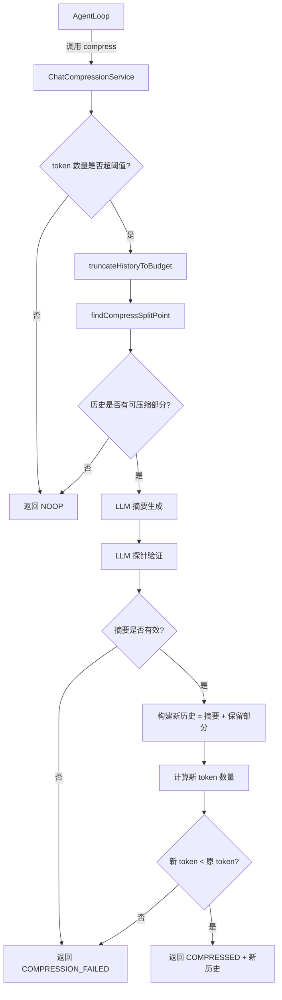

# chatCompressionService.ts

> 对话历史压缩服务，通过 LLM 摘要和工具输出截断来缩减上下文窗口中的 token 数量。

## 概述

`chatCompressionService.ts` 负责在对话历史的 token 数量接近模型上下文窗口限制时，自动或手动压缩对话历史。它采用三阶段策略：首先截断大型工具输出（反向 token 预算策略），然后利用 LLM 对旧的对话内容生成结构化摘要（`<state_snapshot>`），最后通过"探针验证"对摘要进行自我修正，确保关键信息不丢失。该模块在 `services` 层中承担上下文窗口管理的核心角色，是长对话持续运行的关键基础设施。

## 架构图

## 主要导出

### `findCompressSplitPoint(contents: Content[], fraction: number): number`
- **用途**: 确定压缩分割点索引——在该索引之前的内容将被压缩为摘要，之后的内容将被保留。
- **逻辑**: 按字符累计计算，在用户消息边界处查找满足目标占比的分割点，确保不会在函数调用/响应对中间断开。

### `modelStringToModelConfigAlias(model: string): string`
- **用途**: 将主模型名称映射为对应的压缩模型配置别名（如 `chat-compression-2.5-pro`），用于为不同主模型选择适当的压缩模型。

### `class ChatCompressionService`
- **用途**: 对话压缩服务的主类。
- **核心方法**:
  - `compress(chat, promptId, force, model, config, hasFailedCompressionAttempt, abortSignal?)`: 执行完整压缩流程，返回新的对话历史和压缩信息。

## 核心逻辑

1. **token 阈值检查**: 默认当 token 数量超过模型上下文限制的 50%（`DEFAULT_COMPRESSION_TOKEN_THRESHOLD`）时触发自动压缩。
2. **工具输出截断（反向 token 预算）**: `truncateHistoryToBudget` 从最新消息向前遍历，保留近期工具输出完整，当工具输出 token 累计超过 50,000 时，将较旧的大型工具响应截断并保存到临时文件。
3. **分割点计算**: `findCompressSplitPoint` 保留最后 30%（`COMPRESSION_PRESERVE_THRESHOLD`）的对话历史不压缩。
4. **LLM 摘要生成**: 将待压缩部分发送给 LLM，生成 `<state_snapshot>` 结构化摘要。若待压缩内容的原始版本不超出模型 token 限制，则优先使用原始（未截断）内容以保持高保真度。
5. **探针验证（自我修正）**: 第二轮 LLM 调用对生成的摘要进行批判性评估，补充遗漏的技术细节。
6. **失败回退**: 若 LLM 摘要失败（且非强制压缩），仅依赖截断策略；若压缩后 token 反而增加，则放弃压缩。

## 内部依赖

| 模块 | 用途 |
|------|------|
| `../core/geminiChat.js` | `GeminiChat` 类型，获取对话历史 |
| `../core/turn.js` | `CompressionStatus` 枚举，压缩状态定义 |
| `../core/tokenLimits.js` | `tokenLimit` 函数，获取模型 token 上限 |
| `../core/prompts.js` | `getCompressionPrompt`，获取压缩系统提示词 |
| `../utils/partUtils.js` | `getResponseText`，提取 LLM 响应文本 |
| `../utils/fileUtils.js` | 截断工具输出并保存到文件 |
| `../utils/tokenCalculation.js` | token 数量估算和精确计算 |
| `../utils/environmentContext.js` | `getInitialChatHistory`，构建包含系统上下文的初始历史 |
| `../config/models.js` | 各模型常量定义 |
| `../telemetry/loggers.js` | 压缩事件日志记录 |
| `../hooks/types.js` | `PreCompressTrigger`，压缩前钩子触发类型 |

## 外部依赖

| 包 | 用途 |
|----|------|
| `@google/genai` | `Content` 类型定义 |
