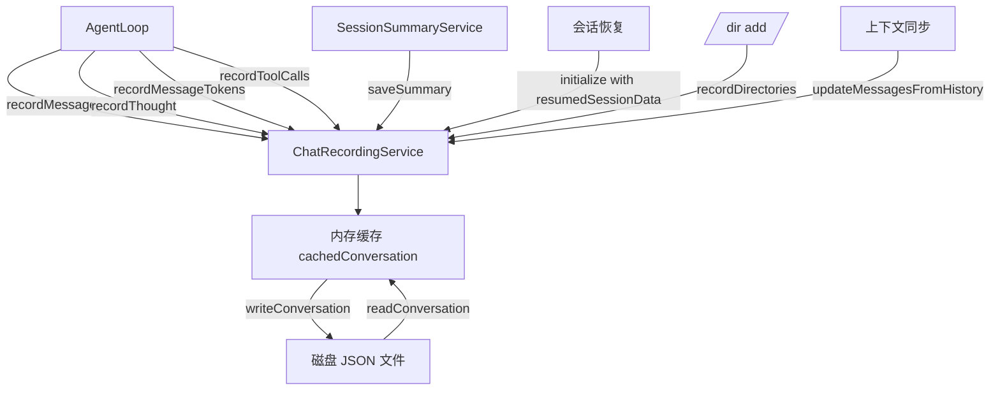

# chatRecordingService.ts

> 对话录制服务，将完整的聊天会话（消息、工具调用、token 使用、思考过程）持久化到磁盘 JSON 文件。

## 概述

`chatRecordingService.ts` 提供全面的对话录制能力，自动将用户和 AI 助手之间的所有交互记录到结构化的 JSON 文件中。会话文件存储在 `~/.gemini/tmp/<project_hash>/chats/` 目录下，支持新建会话和恢复已有会话。该服务在系统架构中属于持久化层，为会话恢复、历史浏览、摘要生成等功能提供数据基础。它还具备优雅降级能力——当磁盘空间不足（ENOSPC）时，自动禁用录制但不中断对话。

## 架构图

## 主要导出

### 常量
- `SESSION_FILE_PREFIX = 'session-'`: 会话文件名前缀。

### 接口/类型
- `TokensSummary`: token 使用统计（输入、输出、缓存、思考、工具、总计）。
- `BaseMessageRecord`: 消息基础字段（id、时间戳、内容）。
- `ToolCallRecord`: 工具调用记录（名称、参数、结果、状态、UI 元数据）。
- `ConversationRecordExtra`: 消息类型（user/info/error/warning/gemini）及其附加字段。
- `MessageRecord`: 完整消息记录类型（基础字段 + 类型附加字段）。
- `ConversationRecord`: 完整会话记录（sessionId、projectHash、时间戳、消息列表、摘要）。
- `ResumedSessionData`: 恢复会话所需数据。

### `class ChatRecordingService`
- `initialize(resumedSessionData?, kind?)`: 初始化服务，创建新会话文件或恢复已有会话。
- `recordMessage(message)`: 记录一条消息到会话文件。
- `recordThought(thought)`: 记录 AI 的思考过程（排队等待与下一条 Gemini 消息关联）。
- `recordMessageTokens(respUsageMetadata)`: 记录 token 使用统计。
- `recordToolCalls(model, toolCalls)`: 记录工具调用及其结果，自动从 ToolRegistry 丰富元数据。
- `saveSummary(summary)`: 保存会话摘要。
- `recordDirectories(directories)`: 记录通过 `/dir add` 添加的工作区目录。
- `getConversation()`: 获取当前会话数据。
- `getConversationFilePath()`: 获取当前会话文件路径。
- `deleteSession(sessionId)`: 删除指定会话及其相关日志和工具输出。
- `rewindTo(messageId)`: 将会话回退到指定消息之前的状态。
- `updateMessagesFromHistory(history)`: 根据 API Content 数组更新磁盘上的工具调用结果。

## 核心逻辑

1. **缓存策略**: 使用 `cachedConversation` 和 `cachedLastConvData` 实现读写缓存，通过 JSON 字符串比较避免不必要的磁盘写入。
2. **思考和 token 排队**: 思考和 token 信息到达时可能还没有对应的 Gemini 消息，因此先缓存在 `queuedThoughts` 和 `queuedTokens` 中，待下一条 Gemini 消息记录时一并写入。
3. **工具调用丰富**: 记录工具调用时自动从 `ToolRegistry` 获取 `displayName`、`description` 等 UI 元数据。
4. **磁盘满处理**: 捕获 `ENOSPC` 错误后将 `conversationFile` 设为 `null`，后续所有操作检测到 `null` 后直接返回，不抛出异常。
5. **会话清理**: `deleteSession` 不仅删除会话文件，还清理关联的活动日志、工具输出目录和会话特定临时目录。

## 内部依赖

| 模块 | 用途 |
|------|------|
| `../core/coreToolScheduler.js` | `Status` 类型 |
| `../utils/thoughtUtils.js` | `ThoughtSummary` 类型 |
| `../utils/paths.js` | `getProjectHash` 哈希计算 |
| `../utils/fileUtils.js` | `sanitizeFilenamePart` 文件名安全处理 |
| `../utils/debugLogger.js` | 调试日志 |
| `../tools/tools.js` | `ToolResultDisplay` 类型 |
| `../config/agent-loop-context.js` | `AgentLoopContext` 上下文 |

## 外部依赖

| 包 | 用途 |
|----|------|
| `@google/genai` | `Content`, `Part`, `PartListUnion`, `GenerateContentResponseUsageMetadata` 类型 |
| `node:fs` | 文件系统同步操作 |
| `node:path` | 路径处理 |
| `node:crypto` | `randomUUID` 生成消息 ID |
