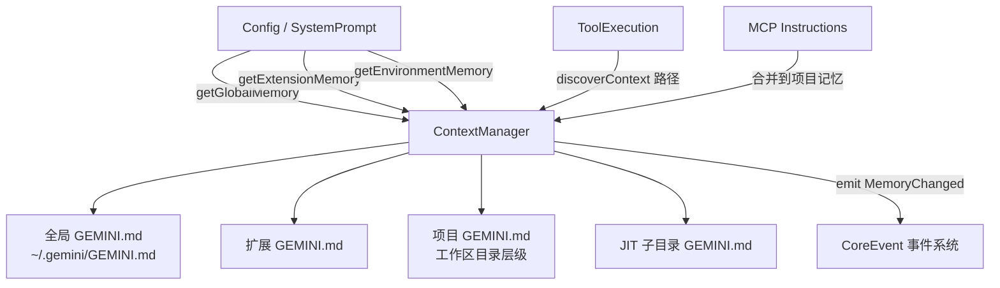

# contextManager.ts

> 上下文管理器，负责发现、加载和分层管理全局/扩展/项目级 GEMINI.md 记忆文件。

## 概述

`ContextManager` 是 Gemini CLI 记忆系统的核心管理器，负责从三个层级（全局、扩展、项目）发现和加载 `GEMINI.md` 指令文件，并将它们组织为分层的系统提示内容。此外，它还支持 JIT（Just-In-Time）子目录记忆的动态发现——当工具访问特定路径时，按需加载该路径沿途的 GEMINI.md 文件。该模块在架构中扮演系统提示上下文注入的角色，确保 LLM 能获得正确的项目指令和上下文信息。

## 架构图

## 主要导出

### `class ContextManager`
- **构造函数**: `constructor(config: Config)`
- `refresh()`: 重新加载所有记忆文件（清除缓存后重新发现和读取）。
- `discoverContext(accessedPath, trustedRoots)`: JIT 发现——根据工具访问的路径，向上遍历到项目根目录，加载沿途尚未加载的 GEMINI.md 文件。
- `getGlobalMemory()`: 获取全局级记忆内容。
- `getExtensionMemory()`: 获取扩展级记忆内容。
- `getEnvironmentMemory()`: 获取项目级记忆内容（包含 MCP 指令）。
- `getLoadedPaths()`: 获取已加载的文件路径集合。

## 核心逻辑

1. **三层记忆发现**: `refresh()` 并行发现全局、扩展和项目三个层级的记忆文件路径。
2. **去重加载**: 对所有路径先字符串去重，再通过文件系统 identity（inode）去重以处理大小写不敏感文件系统，最后批量读取。
3. **分类拼接**: 使用 `categorizeAndConcatenate` 将读取的内容按层级分类，项目记忆还会与 MCP 指令合并。
4. **信任检查**: 项目级记忆仅在文件夹已被信任（`isTrustedFolder()`）时才加载，JIT 发现同理。
5. **增量 JIT 加载**: `discoverContext` 使用 `loadedPaths` 和 `loadedFileIdentities` 避免重复加载，返回的新指令由调用方注入到对话上下文中。

## 内部依赖

| 模块 | 用途 |
|------|------|
| `../utils/memoryDiscovery.js` | 记忆文件发现和读取的全部工具函数 |
| `../config/config.js` | `Config` 配置对象 |
| `../utils/events.js` | `coreEvents` 事件发射、`CoreEvent` 事件类型 |

## 外部依赖

无第三方依赖。
