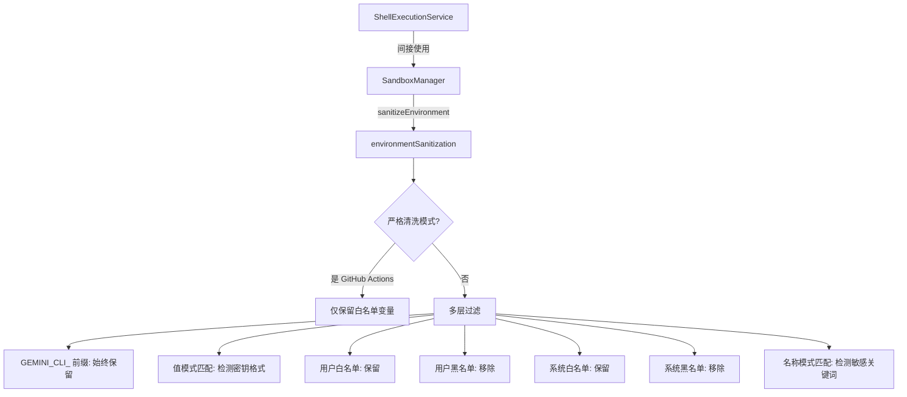

# environmentSanitization.ts

> 环境变量清洗服务，过滤和移除可能包含敏感信息（密钥、token、密码等）的环境变量。

## 概述

`environmentSanitization.ts` 提供环境变量安全过滤功能，在将 `process.env` 传递给子进程或 LLM 之前，移除可能包含凭据、密钥和其他敏感数据的环境变量。它实现了多层防护策略：名称白名单、名称黑名单、名称模式匹配（如包含 TOKEN、SECRET 等关键词）和值模式匹配（如 JWT、GitHub token、AWS 密钥等正则表达式）。在 GitHub Actions 环境中，该模块会启用严格模式，仅保留白名单中的变量。该模块在架构中属于安全层，被 `SandboxManager` 和 `ShellExecutionService` 调用。

## 架构图

## 主要导出

### 类型
- `EnvironmentSanitizationConfig`: 清洗配置，包含 `allowedEnvironmentVariables`、`blockedEnvironmentVariables`、`enableEnvironmentVariableRedaction`。

### 函数
- `sanitizeEnvironment(processEnv, config)`: 根据配置过滤环境变量，返回安全的环境变量副本。

### 常量
- `ALWAYS_ALLOWED_ENVIRONMENT_VARIABLES`: 始终允许的系统变量集合（PATH、HOME、SHELL、TERM 以及 GitHub Actions 相关变量等）。
- `NEVER_ALLOWED_ENVIRONMENT_VARIABLES`: 始终阻止的变量集合（如 DATABASE_URL、CLIENT_ID 等）。
- `NEVER_ALLOWED_NAME_PATTERNS`: 名称敏感模式列表（TOKEN、SECRET、PASSWORD、KEY、AUTH 等正则表达式）。
- `NEVER_ALLOWED_VALUE_PATTERNS`: 值敏感模式列表（私钥、JWT、GitHub token、Google API Key、AWS Access Key、Stripe key、Slack token 等正则表达式）。

## 核心逻辑

`shouldRedactEnvironmentVariable` 函数按以下优先级决定是否移除变量：

1. `GEMINI_CLI_` 前缀的变量始终保留。
2. 值匹配敏感模式（如 JWT、私钥格式）则移除。
3. 用户配置的 `allowedEnvironmentVariables` 中的变量保留。
4. 用户配置的 `blockedEnvironmentVariables` 中的变量移除。
5. `ALWAYS_ALLOWED_ENVIRONMENT_VARIABLES` 中的变量保留。
6. `NEVER_ALLOWED_ENVIRONMENT_VARIABLES` 中的变量移除。
7. 严格模式下，以上未匹配的全部移除。
8. 非严格模式下，名称匹配 `NEVER_ALLOWED_NAME_PATTERNS` 则移除。
9. 其余保留。

严格模式在检测到 `GITHUB_SHA` 或 `SURFACE === 'Github'` 时自动启用。

## 内部依赖

无。

## 外部依赖

无第三方依赖。
