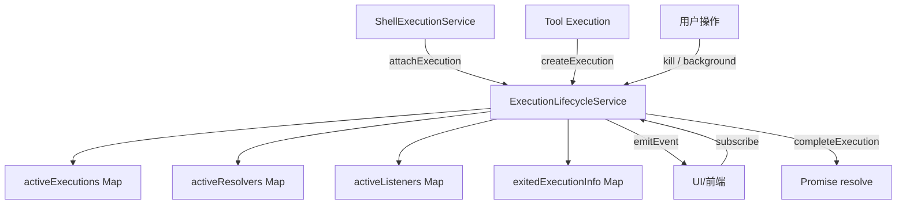

# executionLifecycleService.ts

> 执行生命周期管理中心，统一管理 Shell 命令和工具执行的后台化、输出订阅、终止和完成等生命周期事件。

## 概述

`ExecutionLifecycleService` 是一个静态单例服务，作为所有执行过程（Shell 命令、工具调用等）的集中式生命周期管理器。它抽象了不同执行后端（PTY、child_process、虚拟执行）的差异，提供统一的 API 来创建、附加、后台化、订阅输出、完成和终止执行。该模块在架构中处于核心位置，被 `ShellExecutionService` 和各种工具直接使用，是后台进程管理和实时输出流的基础设施。

## 架构图

## 主要导出

### 类型
- `ExecutionMethod`: 执行方法枚举 (`'lydell-node-pty' | 'node-pty' | 'child_process' | 'remote_agent' | 'none'`)。
- `ExecutionResult`: 执行结果（rawOutput、output、exitCode、signal、error、aborted、pid、executionMethod、backgrounded）。
- `ExecutionHandle`: 执行句柄（pid + 结果 Promise）。
- `ExecutionOutputEvent`: 输出事件（data | binary_detected | binary_progress | exit）。
- `ExecutionCompletionOptions`: 完成选项（exitCode、signal、error、aborted）。
- `ExternalExecutionRegistration`: 外部执行注册信息（执行方法、初始输出、各种回调）。

### `class ExecutionLifecycleService`（全静态方法）
- `attachExecution(executionId, registration)`: 将已有进程（如 PTY、child_process）注册到生命周期管理。
- `createExecution(initialOutput?, onKill?, executionMethod?)`: 创建虚拟执行（用于非进程类型的工具执行）。
- `appendOutput(executionId, chunk)`: 追加输出并通知订阅者。
- `emitEvent(executionId, event)`: 向订阅者发送事件。
- `completeExecution(executionId, options?)`: 完成执行，resolve Promise 并清理状态。
- `completeWithResult(executionId, result)`: 以完整结果完成执行。
- `background(executionId)`: 将执行转为后台运行（resolve Promise 但保持执行活跃）。
- `subscribe(executionId, listener)`: 订阅执行输出事件，返回取消订阅函数。
- `onExit(executionId, callback)`: 注册退出回调（支持已退出进程的即时回调）。
- `kill(executionId)`: 终止执行。
- `isActive(executionId)`: 检查执行是否仍在运行。
- `writeInput(executionId, input)`: 向外部执行写入输入。
- `resetForTest()`: 重置状态（用于单元测试）。

## 核心逻辑

1. **双类型执行**: 支持"虚拟执行"（由 `createExecution` 创建，无对应进程）和"外部执行"（由 `attachExecution` 注册，对应真实进程）。
2. **ID 分配**: 虚拟执行使用 `>= 2,000,000,000` 的自增 ID，避免与真实 PID 冲突。外部执行直接使用进程 PID。
3. **后台化**: `background()` resolve 当前的 Promise（让调用方继续），但不清理 `activeExecutions`，进程继续运行。
4. **退出信息 TTL**: 进程退出后其退出信息保留 5 分钟（`EXIT_INFO_TTL_MS`），供 `onExit` 查询。
5. **订阅快照**: `subscribe()` 注册时立即回放当前输出快照，确保新订阅者不遗漏已有输出。
6. **终止策略**: `kill()` 对虚拟执行调用 `onKill` 回调，对外部执行调用 `kill` 回调，然后以 aborted 结果完成执行。

## 内部依赖

| 模块 | 用途 |
|------|------|
| `../utils/terminalSerializer.js` | `AnsiOutput` 类型（输出事件中的结构化终端数据） |

## 外部依赖

无第三方依赖。
