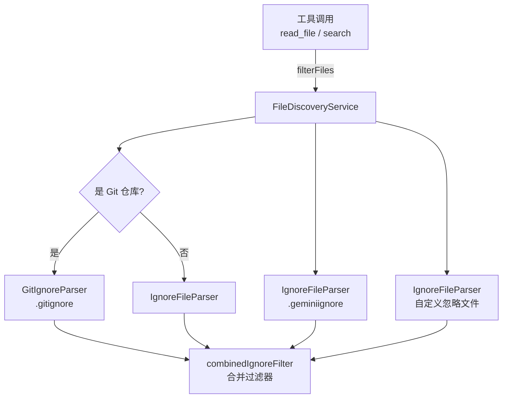

# fileDiscoveryService.ts

> 文件发现服务，基于 .gitignore、.geminiignore 和自定义忽略规则过滤文件路径列表。

## 概述

`FileDiscoveryService` 提供基于多种忽略规则的文件过滤能力。它在初始化时解析项目根目录下的 `.gitignore`、`.geminiignore` 以及用户自定义的忽略文件，并将它们合并为统一的过滤器。该服务在架构中被工具（如文件读取、搜索等）调用，确保 LLM 不会访问被忽略的文件，同时支持 Git 仓库和非 Git 仓库两种场景。

## 架构图

## 主要导出

### 接口
- `FilterFilesOptions`: 过滤选项（`respectGitIgnore`、`respectGeminiIgnore`、`customIgnoreFilePaths`）。
- `FilterReport`: 过滤报告（`filteredPaths`、`ignoredCount`）。

### `class FileDiscoveryService`
- **构造函数**: `constructor(projectRoot: string, options?: FilterFilesOptions)` - 初始化各解析器并创建合并过滤器。
- `filterFiles(filePaths, options?)`: 根据忽略规则过滤文件路径列表，返回通过过滤的路径。
- `filterFilesWithReport(filePaths, opts?)`: 同上但附带过滤报告（包含被忽略的文件数量）。
- `shouldIgnoreFile(filePath, options?)`: 检查单个文件是否应被忽略。
- `getIgnoreFilePaths()`: 获取正在使用的忽略文件路径列表（不含 .gitignore）。
- `getAllIgnoreFilePaths()`: 获取所有忽略文件路径列表（含 .gitignore）。

## 核心逻辑

1. **合并过滤器优化**: 当同时启用 gitignore 和 geminiignore 时，使用预合并的 `combinedIgnoreFilter` 进行一次性判断，避免多次遍历。
2. **Git/非 Git 适配**: 在 Git 仓库中使用 `GitIgnoreParser`（能理解 Git 特有的忽略语义），非 Git 仓库中使用 `IgnoreFileParser`。
3. **自定义忽略优先级**: 自定义忽略模式排在 geminiignore 之后加载，确保自定义规则可以覆盖 geminiignore 的规则。

## 内部依赖

| 模块 | 用途 |
|------|------|
| `../utils/gitIgnoreParser.js` | Git 忽略规则解析 |
| `../utils/ignoreFileParser.js` | 通用忽略规则解析 |
| `../utils/gitUtils.js` | `isGitRepository` 判断 |
| `../config/constants.js` | `GEMINI_IGNORE_FILE_NAME` 常量 |

## 外部依赖

| 包 | 用途 |
|----|------|
| `node:fs` | 文件系统操作（检查 .gitignore 存在性） |
| `node:path` | 路径处理 |
