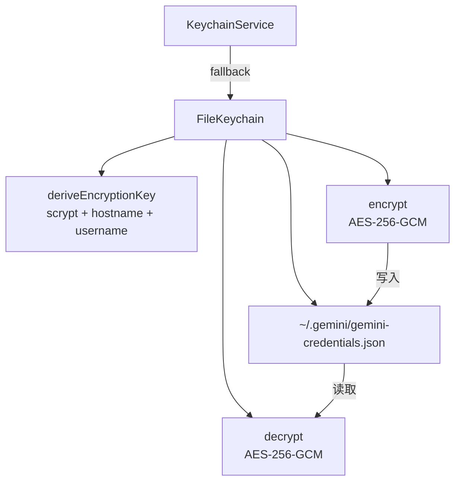

# fileKeychain.ts

> 基于加密文件的密钥链实现，当操作系统原生密钥链不可用时作为安全存储的回退方案。

## 概述

`FileKeychain` 实现了 `Keychain` 接口，使用 AES-256-GCM 加密将凭据存储在本地文件 `~/.gemini/gemini-credentials.json` 中。加密密钥通过 `scrypt` 从机器标识信息（主机名 + 用户名）派生，确保凭据仅在同一机器上可解密。该模块在架构中是 `KeychainService` 的回退后端——当操作系统原生密钥链（keytar）不可用或功能验证失败时自动使用。

## 架构图

## 主要导出

### `class FileKeychain implements Keychain`
- `getPassword(service, account)`: 获取指定服务和账户的密码。
- `setPassword(service, account, password)`: 存储密码。
- `deletePassword(service, account)`: 删除密码，若无剩余凭据则删除整个文件。
- `findCredentials(service)`: 列出指定服务下的所有账户及密码。

## 核心逻辑

1. **密钥派生**: 使用 `crypto.scryptSync` 从固定盐值（`{hostname}-{username}-gemini-cli`）和固定密码（`gemini-cli-oauth`）派生 32 字节加密密钥。
2. **加密格式**: 加密数据格式为 `{iv_hex}:{authTag_hex}:{ciphertext_hex}`，使用 AES-256-GCM 提供认证加密。
3. **数据结构**: 底层数据为嵌套字典 `{ service: { account: password } }`，整体加密后存储。
4. **文件权限**: 目录权限 `0o700`，文件权限 `0o600`，确保仅当前用户可访问。
5. **损坏检测**: 解密失败时提示用户删除或重命名凭据文件。
6. **清理策略**: 删除最后一个凭据后自动删除整个文件。

## 内部依赖

| 模块 | 用途 |
|------|------|
| `./keychainTypes.js` | `Keychain` 接口定义 |
| `../utils/paths.js` | `GEMINI_DIR`, `homedir` 路径常量 |

## 外部依赖

| 包 | 用途 |
|----|------|
| `node:fs/promises` | 异步文件操作 |
| `node:path` | 路径处理 |
| `node:os` | 获取主机名和用户信息 |
| `node:crypto` | 加密/解密/密钥派生 |
