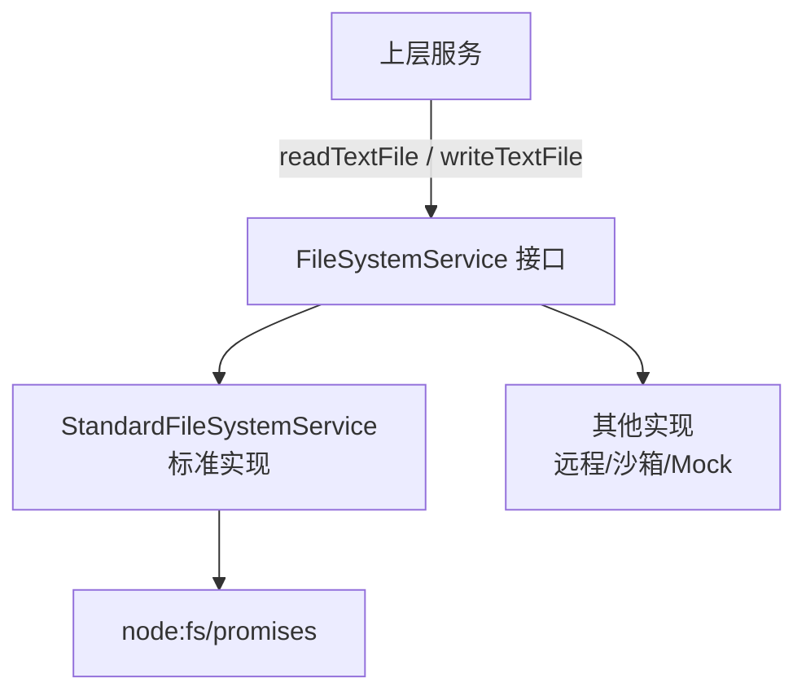

# fileSystemService.ts

> 文件系统操作的抽象接口及标准实现，支持不同执行环境下的文件读写委托。

## 概述

`fileSystemService.ts` 定义了一个简洁的文件系统操作接口 `FileSystemService`，并提供了基于 Node.js `fs/promises` 的标准实现 `StandardFileSystemService`。该抽象层的设计目的是允许在不同运行环境（如本地、远程、沙箱）中替换文件系统的具体实现，同时为测试提供便捷的 mock 注入点。该模块在架构中处于基础设施层，被需要文件读写的上层服务调用。

## 架构图

## 主要导出

### 接口
- `FileSystemService`: 文件系统操作接口。
  - `readTextFile(filePath: string): Promise<string>` - 读取文本文件内容。
  - `writeTextFile(filePath: string, content: string): Promise<void>` - 写入文本文件内容。

### 类
- `StandardFileSystemService implements FileSystemService`: 标准实现，直接委托给 `fs.readFile` / `fs.writeFile`，使用 `utf-8` 编码。

## 核心逻辑

该模块极为简洁，仅包含接口定义和直接委托实现，不包含业务逻辑。其价值在于提供依赖反转的抽象点。

## 内部依赖

无。

## 外部依赖

| 包 | 用途 |
|----|------|
| `node:fs/promises` | 异步文件读写 |
