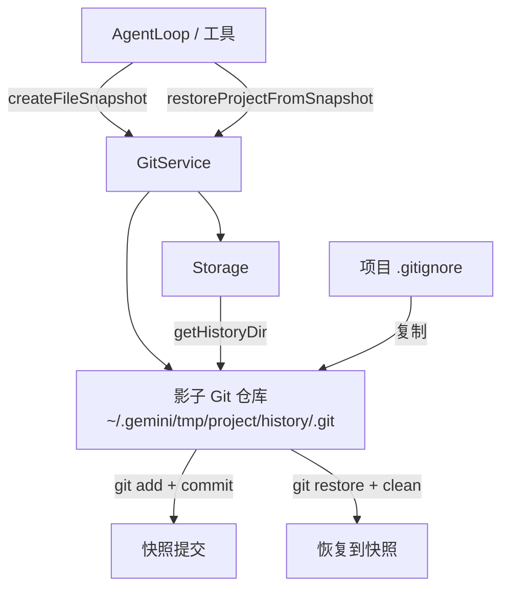

# gitService.ts

> Git 检查点服务，通过影子 Git 仓库实现项目文件的快照和恢复功能。

## 概述

`GitService` 提供基于 Git 的文件检查点（checkpoint）机制。它在项目的临时存储目录中创建一个独立的"影子 Git 仓库"（shadow repository），使用该仓库来跟踪项目文件变更并创建快照。当 LLM 执行的操作导致项目状态异常时，可以通过恢复到之前的快照来回退更改。该服务在架构中属于安全和恢复层，与项目本身的 Git 仓库完全隔离。

## 架构图

## 主要导出

### `class GitService`
- **构造函数**: `constructor(projectRoot: string, storage: Storage)`
- `initialize()`: 初始化服务，验证 Git 可用性并设置影子仓库。
- `static verifyGitAvailability()`: 检查系统是否安装了 Git。
- `getCurrentCommitHash()`: 获取影子仓库当前 HEAD 的 commit hash。
- `createFileSnapshot(message: string)`: 创建文件快照（git add + commit），返回 commit hash。若无更改则返回当前 HEAD hash。
- `restoreProjectFromSnapshot(commitHash: string)`: 从指定快照恢复项目文件（git restore + clean）。

## 核心逻辑

1. **影子仓库隔离**: 在项目临时目录下创建独立的 Git 仓库，使用 `GIT_DIR` 和 `GIT_WORK_TREE` 环境变量使其追踪项目目录的文件变更。
2. **配置隔离**: 创建专用的 `.gitconfig` 和空的 `.gitconfig_system_empty`，通过 `GIT_CONFIG_GLOBAL` / `GIT_CONFIG_SYSTEM` 环境变量防止继承用户的全局 Git 配置（用户名、邮箱、GPG 签名等）。
3. **忽略规则同步**: 将项目的 `.gitignore` 内容复制到影子仓库的 `.gitignore`，确保影子仓库遵循相同的忽略规则。
4. **无验证提交**: 使用 `--no-verify` 跳过 Git hooks，避免项目中的 pre-commit hooks 干扰快照创建。
5. **恢复策略**: 使用 `git restore --source <hash> .` 恢复文件内容，然后 `git clean -f -d` 删除快照后新增的未追踪文件。

## 内部依赖

| 模块 | 用途 |
|------|------|
| `../utils/errors.js` | `isNodeError` 错误类型判断 |
| `../utils/shell-utils.js` | `spawnAsync` 命令执行 |
| `../config/storage.js` | `Storage` 存储管理 |
| `../utils/debugLogger.js` | 调试日志 |

## 外部依赖

| 包 | 用途 |
|----|------|
| `simple-git` | Git 操作封装库 |
| `node:fs/promises` | 异步文件操作 |
| `node:path` | 路径处理 |
