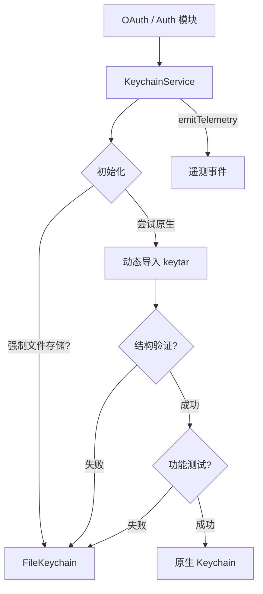

# keychainService.ts

> 密钥链服务，提供操作系统级安全存储的统一访问，支持原生密钥链和加密文件回退。

## 概述

`KeychainService` 是安全凭据存储的入口服务，为 OAuth token 等敏感数据提供安全持久化。它首先尝试加载操作系统原生密钥链（通过动态导入 `keytar` 模块），若不可用则自动回退到基于加密文件的 `FileKeychain`。该服务使用惰性初始化和 Promise 缓存确保初始化只执行一次，并通过 set-get-delete 功能测试循环验证密钥链的实际可用性。在架构中，它是 OAuth 认证模块和其他需要安全存储功能的模块的唯一接口。

## 架构图

## 主要导出

### 常量
- `FORCE_FILE_STORAGE_ENV_VAR = 'GEMINI_FORCE_FILE_STORAGE'`: 环境变量名，设为 `'true'` 时强制使用文件存储。

### `class KeychainService`
- **构造函数**: `constructor(serviceName: string)` - `serviceName` 是在 OS 密钥链中的应用标识。
- `isAvailable()`: 检查密钥链是否可用。
- `isUsingFileFallback()`: 检查是否正在使用文件回退。
- `getPassword(account)`: 获取指定账户的密码。
- `setPassword(account, value)`: 存储密码。
- `deletePassword(account)`: 删除密码。
- `findCredentials()`: 列出所有凭据。

## 核心逻辑

1. **惰性单次初始化**: 使用 `initializationPromise` 确保 `initializeKeychain()` 只执行一次，避免竞态条件。
2. **初始化流程**:
   - 若设置了 `GEMINI_FORCE_FILE_STORAGE=true`，直接使用 `FileKeychain`。
   - 否则尝试动态导入 `keytar` 模块。
   - 使用 Zod schema（`KeychainSchema`）验证模块结构是否符合 `Keychain` 接口。
   - 执行功能测试（set-get-delete 循环）验证密钥链实际可写可读。
   - 任何步骤失败都回退到 `FileKeychain`。
3. **遥测**: 初始化完成后发送 `KeychainAvailabilityEvent` 遥测事件，报告原生密钥链是否可用。
4. **安全日志**: 错误日志仅记录消息字符串，不记录完整错误对象，避免 PII 泄露。

## 内部依赖

| 模块 | 用途 |
|------|------|
| `./keychainTypes.js` | `Keychain` 接口、`KeychainSchema` 验证 schema、`KEYCHAIN_TEST_PREFIX` |
| `./fileKeychain.js` | `FileKeychain` 文件存储回退实现 |
| `../utils/events.js` | `coreEvents` 事件发射 |
| `../telemetry/types.js` | `KeychainAvailabilityEvent` 遥测事件 |
| `../utils/debugLogger.js` | 调试日志 |
| `../utils/markdownUtils.js` | `isRecord` 类型守卫 |

## 外部依赖

| 包 | 用途 |
|----|------|
| `node:crypto` | 生成随机测试账户名 |
| `keytar` (可选) | OS 原生密钥链（运行时动态导入） |
