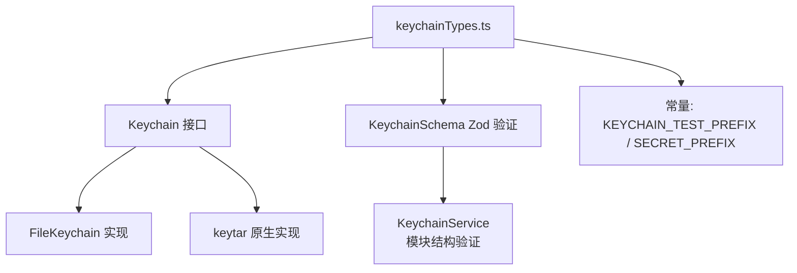

# keychainTypes.ts

> 密钥链接口定义和 Zod 验证 schema，为安全存储后端提供统一的类型契约。

## 概述

`keychainTypes.ts` 定义了密钥链操作的核心接口 `Keychain` 和用于运行时结构验证的 Zod schema `KeychainSchema`。该模块是密钥链子系统的类型基础，被 `KeychainService`、`FileKeychain` 以及原生 keytar 模块加载逻辑共同使用。它确保所有密钥链后端实现遵循一致的 API 契约。

## 架构图

## 主要导出

### 接口
- `Keychain`: 安全存储操作接口。
  - `getPassword(service, account): Promise<string | null>` - 获取密码。
  - `setPassword(service, account, password): Promise<void>` - 存储密码。
  - `deletePassword(service, account): Promise<boolean>` - 删除密码。
  - `findCredentials(service): Promise<Array<{ account: string; password: string }>>` - 列出凭据。

### 常量
- `KeychainSchema`: Zod schema，用于验证动态导入的模块是否具备 `Keychain` 接口所需的四个方法。
- `KEYCHAIN_TEST_PREFIX = '__keychain_test__'`: 功能测试时使用的临时账户名前缀。
- `SECRET_PREFIX = '__secret__'`: 密钥存储条目的前缀标识。

## 核心逻辑

该模块仅包含类型定义和常量，不包含业务逻辑。`KeychainSchema` 使用 `z.function()` 验证导入模块上存在四个函数属性，确保动态导入的 keytar 模块结构正确。

## 内部依赖

无。

## 外部依赖

| 包 | 用途 |
|----|------|
| `zod` | 运行时 schema 验证 |
