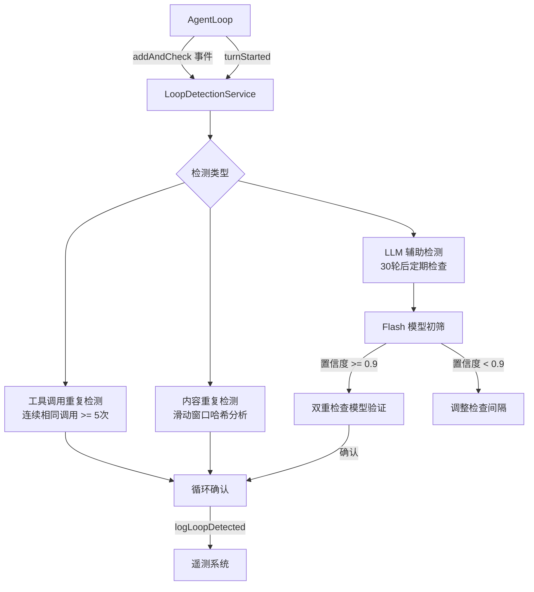

# loopDetectionService.ts

> 循环检测服务，监控 AI 响应中的重复模式（工具调用循环、内容重复、LLM 判定的无效循环），防止无限循环。

## 概述

`LoopDetectionService` 是一个多策略循环检测系统，用于识别和阻止 AI 助手陷入无效的重复行为。它实现了三种检测机制：(1) 连续相同工具调用检测——当相同工具以相同参数被连续调用超过阈值时触发；(2) 内容重复检测——通过滑动窗口哈希分析流式输出中的重复文本模式；(3) LLM 辅助检测——在长对话中定期调用轻量级 LLM 分析对话历史，判断是否存在无效循环（支持双模型交叉验证）。该模块在架构中属于对话控制层，被 `AgentLoop` 在每次 LLM 响应处理时调用。

## 架构图

## 主要导出

### 接口
- `LoopDetectionResult`: 检测结果（`count` 检测次数、`type?` 循环类型、`detail?` 详情、`confirmedByModel?` 确认模型）。

### `class LoopDetectionService`
- **构造函数**: `constructor(context: AgentLoopContext)`
- `disableForSession()`: 为当前会话禁用循环检测。
- `addAndCheck(event: ServerGeminiStreamEvent): LoopDetectionResult`: 处理流事件并检查循环。
- `turnStarted(signal: AbortSignal): Promise<LoopDetectionResult>`: 每轮开始时的异步检查（含 LLM 检测）。
- `reset(promptId, userPrompt?)`: 重置所有检测状态（新提示词开始时调用）。
- `clearDetection()`: 清除已检测到的循环标记（允许恢复轮继续）。

## 核心逻辑

### 工具调用重复检测
- 对工具名称和参数进行 SHA-256 哈希，与上一次调用比较。
- 连续相同调用达到 `TOOL_CALL_LOOP_THRESHOLD`（5 次）时判定为循环。

### 内容重复检测
- 维护最多 `MAX_HISTORY_LENGTH`（5000 字符）的流式内容缓冲区。
- 使用固定大小（50 字符）的滑动窗口提取文本块并计算哈希。
- 跟踪每个哈希出现的位置索引，当相同文本块在短距离内出现 `CONTENT_LOOP_THRESHOLD`（10 次）时判定为循环。
- 额外验证：检查重复间隔的文本（"周期"）是否高度重复，排除列表项等正常重复。
- 代码块内的内容不参与检测，避免误报。
- 遇到表格、列表、标题等特殊内容元素时重置追踪状态。

### LLM 辅助检测
- 在单个提示词的对话达到 `LLM_CHECK_AFTER_TURNS`（30 轮）后激活。
- 以可调节的间隔（默认 10 轮，范围 5-15 轮）调用 LLM 分析最近 20 轮对话历史。
- 使用结构化输出（JSON schema）获取循环置信度评分。
- 初筛模型置信度 >= 0.9 时，使用双重检查模型进行交叉验证。
- 根据置信度动态调整下次检查间隔：高置信度 -> 更频繁检查，低置信度 -> 更低频检查。
- LLM 系统提示详细定义了"无效状态"的判定标准，包括区分批处理操作（跨文件编辑等正常工作）和真正的循环。

## 内部依赖

| 模块 | 用途 |
|------|------|
| `../core/turn.js` | `GeminiEventType`, `ServerGeminiStreamEvent` |
| `../telemetry/loggers.js` | 循环检测遥测日志 |
| `../telemetry/types.js` | `LoopDetectedEvent`, `LoopType`, `LlmLoopCheckEvent`, `LlmRole` |
| `../utils/messageInspectors.js` | `isFunctionCall`, `isFunctionResponse` |
| `../utils/debugLogger.js` | 调试日志 |
| `../config/agent-loop-context.js` | `AgentLoopContext` |

## 外部依赖

| 包 | 用途 |
|----|------|
| `@google/genai` | `Content` 类型 |
| `node:crypto` | SHA-256 哈希计算 |
