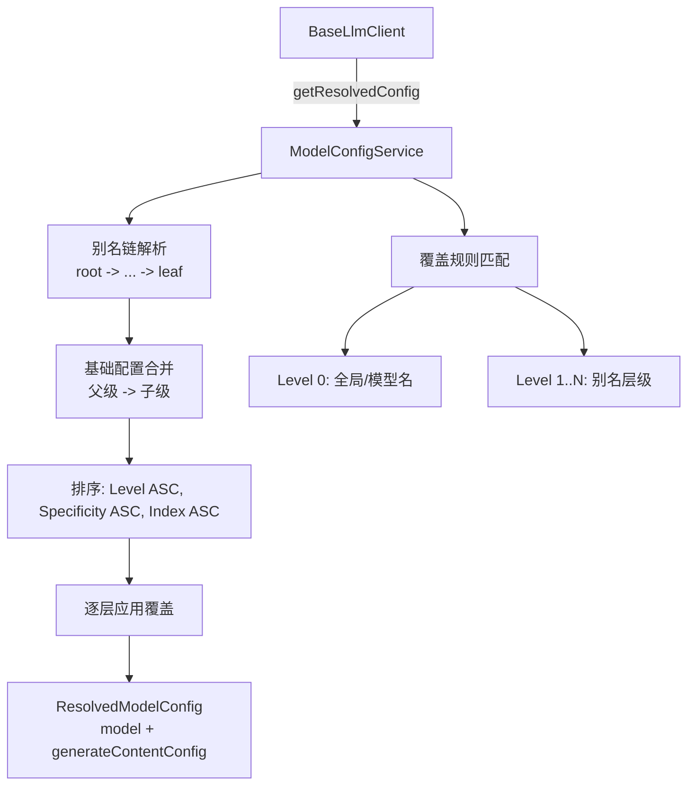

# modelConfigService.ts

> 模型配置服务，通过别名链解析和多层覆盖机制，将模型配置请求解析为最终的模型名称和生成参数。

## 概述

`ModelConfigService` 是 Gemini CLI 的模型配置核心，负责将模型配置请求（可能是别名、模型名或带有作用域的请求）解析为最终的 `ResolvedModelConfig`（包含实际模型名称和 `GenerateContentConfig`）。它实现了一套灵活的配置体系：别名可以继承其他别名形成链式关系，覆盖规则可以基于模型名、别名名、覆盖作用域和重试状态进行精确匹配。该模块在架构中是所有 LLM 调用的配置入口，确保不同场景（压缩、循环检测、摘要等）使用正确的模型和参数。

## 架构图

## 主要导出

### 接口/类型
- `ModelConfigKey`: 配置请求键（`model` 模型名/别名、`overrideScope?` 覆盖作用域、`isRetry?` 是否重试、`isChatModel?` 是否主聊天模型）。
- `ModelConfig`: 模型配置（`model?` 模型名、`generateContentConfig?` 生成配置）。
- `ModelConfigOverride`: 覆盖规则（`match` 匹配条件 + `modelConfig` 配置）。
- `ModelConfigAlias`: 别名定义（`extends?` 继承别名、`modelConfig` 配置）。
- `ModelConfigServiceConfig`: 服务配置（`aliases`、`customAliases`、`overrides`、`customOverrides`）。
- `ResolvedModelConfig`: 解析后的最终配置（branded type，包含必需的 `model` 和 `generateContentConfig`）。

### `class ModelConfigService`
- **构造函数**: `constructor(config: ModelConfigServiceConfig)`
- `registerRuntimeModelConfig(aliasName, alias)`: 运行时注册别名。
- `registerRuntimeModelOverride(override)`: 运行时注册覆盖规则。
- `getResolvedConfig(context: ModelConfigKey): ResolvedModelConfig`: 解析配置请求，返回最终配置。

### 静态方法
- `ModelConfigService.merge(base, override)`: 合并两个 `ModelConfig`。
- `ModelConfigService.deepMerge(config1, config2)`: 深度合并 `GenerateContentConfig`。
- `ModelConfigService.isObject(item)`: 对象类型守卫。

## 核心逻辑

### 解析流水线
1. **别名链解析**: 从请求的模型名/别名开始，沿 `extends` 链向上遍历到根别名，然后反转为 root-to-leaf 顺序。逐层合并配置，子级覆盖父级。最大深度 100，检测循环依赖。
2. **chat-base 回退**: 若请求的模型名不是已知别名且标记为 `isChatModel`，则尝试将 `chat-base` 别名的配置作为基础配置。
3. **Level 映射构建**: 将别名链中的每个别名和解析出的模型名映射到 Level 值（模型名 Level 0，别名从 Level 1 开始）。
4. **覆盖匹配**: 遍历所有覆盖规则（内置 + 自定义 + 运行时），检查 `match` 中的每个字段是否与当前请求上下文匹配。`overrideScope: 'core'` 匹配 `'core'` 或未设置的情况。
5. **排序**: 匹配的覆盖按 Level 升序、Specificity（匹配字段数量）升序、配置顺序升序排列。
6. **应用**: 按排序顺序逐个将覆盖的 `modelConfig` 深度合并到当前配置上。

### 深度合并规则
- 对象属性递归合并。
- 数组不深度合并（直接覆盖），确保用户可以完全替换基础数组。
- 覆盖的 `model` 字段优先于基础的 `model`。

## 内部依赖

无。

## 外部依赖

| 包 | 用途 |
|----|------|
| `@google/genai` | `GenerateContentConfig` 类型 |
