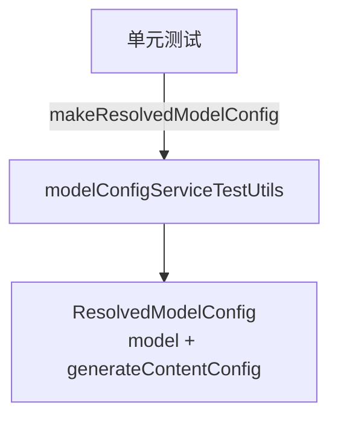

# modelConfigServiceTestUtils.ts

> 模型配置测试工具，提供创建 `ResolvedModelConfig` 实例的工厂函数，简化单元测试。

## 概述

`modelConfigServiceTestUtils.ts` 是一个纯测试辅助模块，导出一个工厂函数 `makeResolvedModelConfig`，用于在单元测试中方便地创建带有合理默认值的 `ResolvedModelConfig` 实例。它解决了 `ResolvedModelConfig` 作为 branded type 不能直接构造的问题。该模块在架构中仅服务于测试代码。

## 架构图

## 主要导出

### `makeResolvedModelConfig(model: string, overrides?: Partial<GenerateContentConfig>): ResolvedModelConfig`
- **用途**: 创建 `ResolvedModelConfig` 实例。
- **参数**:
  - `model`: 模型名称。
  - `overrides`: 可选的 `generateContentConfig` 部分覆盖。
- **默认值**: `temperature: 0`, `topP: 1`。

## 核心逻辑

直接构造对象并通过类型断言转换为 branded type `ResolvedModelConfig`，使用展开运算符合并默认值和用户提供的覆盖。

## 内部依赖

| 模块 | 用途 |
|------|------|
| `../services/modelConfigService.js` | `ResolvedModelConfig` 类型 |

## 外部依赖

无。
