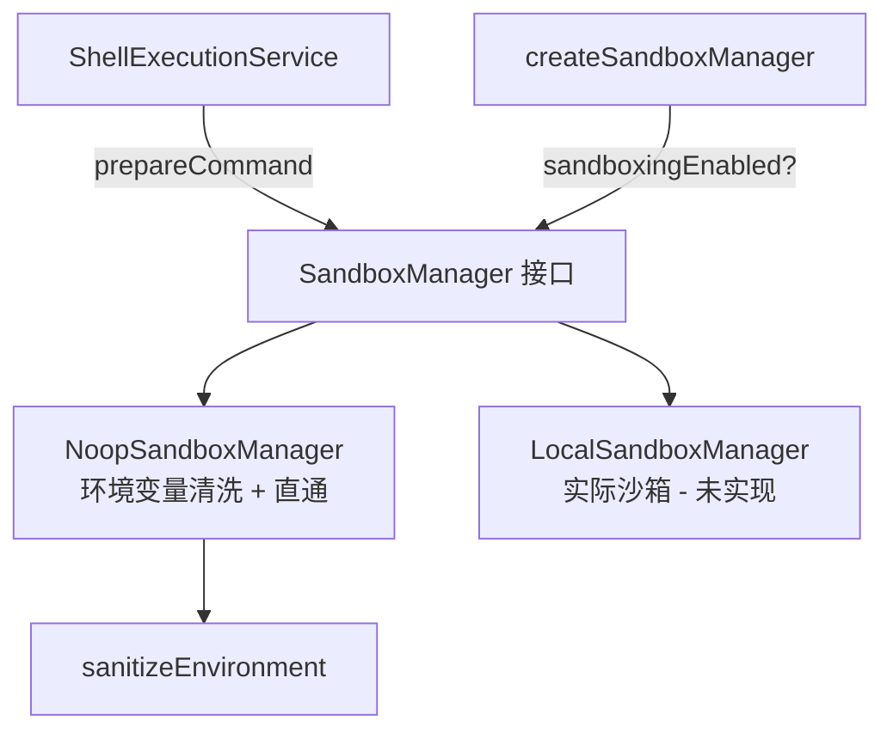

# sandboxManager.ts

> 沙箱管理器，为命令执行提供沙箱隔离和环境变量清洗。

## 概述

`sandboxManager.ts` 定义了沙箱管理器的接口和实现，负责在执行 Shell 命令之前对其进行安全处理。目前提供两个实现：`NoopSandboxManager`（无沙箱，仅进行环境变量清洗）和 `LocalSandboxManager`（实际沙箱，尚未实现）。该模块在架构中位于 `ShellExecutionService` 和实际命令执行之间，是命令安全执行的拦截层。工厂函数 `createSandboxManager` 根据配置决定使用哪种实现。

## 架构图

## 主要导出

### 接口
- `SandboxRequest`: 沙箱请求（`command` 程序名、`args` 参数、`cwd` 工作目录、`env` 环境变量、`config?` 沙箱配置）。
- `SandboxedCommand`: 沙箱处理后的命令（`program` 程序名、`args` 参数、`env` 清洗后的环境变量、`cwd?` 工作目录）。
- `SandboxManager`: 沙箱管理器接口。
  - `prepareCommand(req: SandboxRequest): Promise<SandboxedCommand>` - 准备沙箱化命令。

### 类
- `NoopSandboxManager implements SandboxManager`: 无沙箱实现，仅清洗环境变量后原样传递命令和参数。
- `LocalSandboxManager implements SandboxManager`: 实际沙箱实现（当前抛出 "not yet implemented" 错误）。

### 函数
- `createSandboxManager(sandboxingEnabled: boolean): SandboxManager` - 工厂函数，根据 `sandboxingEnabled` 返回对应实现。

## 核心逻辑

`NoopSandboxManager.prepareCommand` 的流程：
1. 从请求配置中提取清洗配置（白名单、黑名单、是否启用重编辑），缺省值为空列表和启用重编辑。
2. 调用 `sanitizeEnvironment` 对环境变量进行安全过滤。
3. 返回原始的 `command` 和 `args`，搭配清洗后的 `env`。

## 内部依赖

| 模块 | 用途 |
|------|------|
| `./environmentSanitization.js` | `sanitizeEnvironment` 函数、`EnvironmentSanitizationConfig` 类型 |

## 外部依赖

无第三方依赖。
