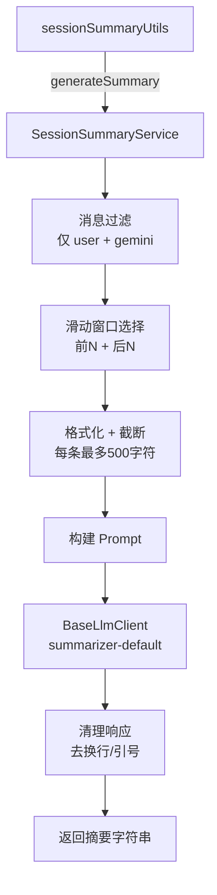

# sessionSummaryService.ts

> 会话摘要生成服务，使用 LLM 为聊天会话生成简洁的用户意图摘要。

## 概述

`SessionSummaryService` 使用轻量级 LLM（通过 `summarizer-default` 模型配置别名）为聊天会话生成一句话摘要（最多 80 字符），聚焦于用户的主要意图或目标。摘要用于会话列表的预览显示，帮助用户快速识别历史会话。该服务在架构中被 `sessionSummaryUtils.ts` 调用，作为会话管理功能的一部分。

## 架构图

## 主要导出

### 接口
- `GenerateSummaryOptions`: 摘要生成选项（`messages` 消息列表、`maxMessages?` 最大消息数、`timeout?` 超时时间）。

### `class SessionSummaryService`
- **构造函数**: `constructor(baseLlmClient: BaseLlmClient)`
- `generateSummary(options: GenerateSummaryOptions): Promise<string | null>` - 生成摘要，失败时返回 `null`。

## 核心逻辑

1. **消息过滤**: 仅保留 `user` 和 `gemini` 类型的消息，排除 `info`、`error`、`warning` 等系统消息。
2. **滑动窗口选择**: 当消息数超过 `maxMessages`（默认 20）时，取前半和后半各 N 条消息，确保覆盖对话的开始和结束。
3. **消息格式化**: 每条消息截断至 `MAX_MESSAGE_LENGTH`（500 字符），并标注角色（User/Assistant）。
4. **超时控制**: 使用 `AbortController` 实现超时（默认 5000ms），超时后优雅放弃。
5. **响应清理**: 移除换行符、标准化空白、去除模型可能添加的引号。
6. **优雅降级**: 所有错误（包括超时、空响应等）都被捕获并返回 `null`，不会中断主流程。

## 内部依赖

| 模块 | 用途 |
|------|------|
| `./chatRecordingService.js` | `MessageRecord` 类型 |
| `../core/baseLlmClient.js` | `BaseLlmClient` LLM 客户端 |
| `../core/geminiRequest.js` | `partListUnionToString` 内容转换 |
| `../utils/debugLogger.js` | 调试日志 |
| `../utils/partUtils.js` | `getResponseText` 响应提取 |
| `../telemetry/types.js` | `LlmRole` 角色标识 |

## 外部依赖

| 包 | 用途 |
|----|------|
| `@google/genai` | `Content` 类型 |
