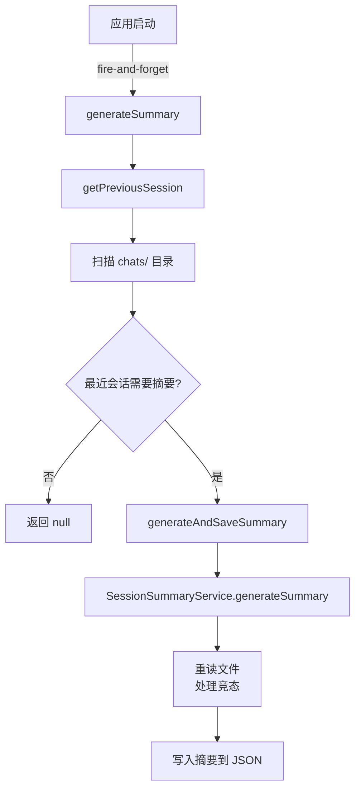

# sessionSummaryUtils.ts

> 会话摘要工具函数，在应用启动时为上一个缺少摘要的会话自动生成摘要。

## 概述

`sessionSummaryUtils.ts` 提供会话摘要的发现和生成的编排逻辑。它在应用启动时被"即发即忘"地调用，查找最近创建的、尚未生成摘要的会话文件，然后调用 `SessionSummaryService` 为其生成摘要并写回磁盘。该模块在架构中是 `SessionSummaryService` 的上层编排器，负责会话文件的发现、读取、写入和竞态条件处理。

## 架构图

## 主要导出

### `getPreviousSession(config: Config): Promise<string | null>`
- **用途**: 查找最近创建的需要摘要的会话文件路径。
- **逻辑**: 列出 `chats/` 目录下的会话文件，按文件名降序排列（最新优先），检查最近的会话是否已有摘要以及用户消息数是否超过阈值（`> 1`）。

### `generateSummary(config: Config): Promise<void>`
- **用途**: 启动时调用的入口函数，为上一个会话生成摘要（若需要）。设计为即发即忘，不抛出异常。

## 核心逻辑

1. **会话发现**: 扫描项目临时目录下的 `chats/` 子目录，过滤以 `session-` 开头的 `.json` 文件，按文件名排序取最新。
2. **摘要必要性检查**: 已有摘要则跳过；用户消息数不超过 `MIN_MESSAGES_FOR_SUMMARY`（1）则跳过。
3. **竞态条件处理**: 生成摘要后，重新读取文件检查是否已被其他进程写入了摘要，避免覆盖。
4. **优雅降级**: 所有错误都被捕获并记录到调试日志，不影响应用启动流程。

## 内部依赖

| 模块 | 用途 |
|------|------|
| `../config/config.js` | `Config` 配置对象 |
| `./sessionSummaryService.js` | `SessionSummaryService` 摘要生成 |
| `../core/baseLlmClient.js` | `BaseLlmClient` LLM 客户端 |
| `../utils/debugLogger.js` | 调试日志 |
| `./chatRecordingService.js` | `SESSION_FILE_PREFIX`, `ConversationRecord` |

## 外部依赖

| 包 | 用途 |
|----|------|
| `node:fs/promises` | 异步文件操作 |
| `node:path` | 路径处理 |
