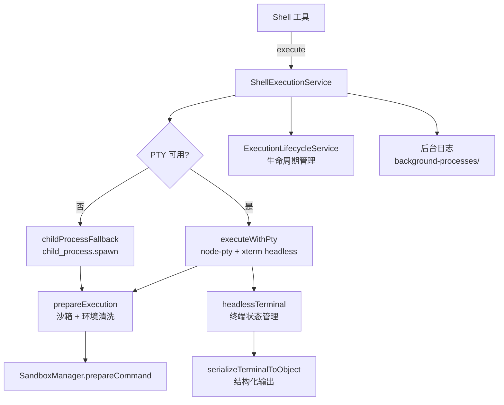

# shellExecutionService.ts

> Shell 命令执行服务，支持通过 PTY（伪终端）和 child_process 两种方式执行命令，具备流式输出、后台化、二进制检测和终端仿真能力。

## 概述

`ShellExecutionService` 是 Gemini CLI 的核心命令执行引擎，负责在用户工作区中执行 Shell 命令。它优先使用 PTY（`node-pty`）执行以获得完整的终端仿真能力（颜色、交互式程序支持），当 PTY 不可用时回退到 `child_process`。该服务集成了丰富的功能：使用 `@xterm/headless` 进行终端状态管理和结构化输出序列化、支持将运行中的命令移至后台并记录日志、二进制输出检测、Bash 安全选项（禁用 `promptvars` 等危险 shell 选项）、环境变量清洗和沙箱化命令准备。该模块在架构中是 Shell 工具的底层执行后端，所有 Shell 命令最终都通过此服务执行。

## 架构图

## 主要导出

### 常量
- `GEMINI_CLI_IDENTIFICATION_ENV_VAR = 'GEMINI_CLI'`: 识别环境变量名。
- `GEMINI_CLI_IDENTIFICATION_ENV_VAR_VALUE = '1'`: 识别环境变量值。
- `SCROLLBACK_LIMIT = 300000`: PTY 终端回滚行数限制。

### 类型
- `ShellExecutionResult`: 等同于 `ExecutionResult`。
- `ShellExecutionHandle`: 等同于 `ExecutionHandle`。
- `ShellExecutionConfig`: 执行配置（终端尺寸、分页器、颜色、清洗配置、沙箱管理器等）。
- `ShellOutputEvent`: 等同于 `ExecutionOutputEvent`。

### `class ShellExecutionService`（全静态方法）
- `execute(command, cwd, onOutputEvent, abortSignal, shouldUseNodePty, config)`: 执行命令，返回执行句柄（pid + 结果 Promise）。
- `writeToPty(pid, input)`: 向运行中的 PTY 写入输入。
- `isPtyActive(pid)`: 检查 PTY 是否活跃。
- `onExit(pid, callback)`: 注册进程退出回调。
- `kill(pid)`: 终止进程。
- `background(pid)`: 将运行中的进程移至后台。
- `subscribe(pid, listener)`: 订阅进程输出事件。
- `resizePty(pid, cols, rows)`: 调整 PTY 终端尺寸。
- `scrollPty(pid, lines)`: 滚动 PTY 终端。

### 内部辅助
- `getLogDir()`: 获取后台进程日志目录。
- `getLogFilePath(pid)`: 获取特定进程的日志文件路径。

## 核心逻辑

### PTY 执行路径 (`executeWithPty`)
1. 获取 shell 配置（可执行文件路径、参数前缀、shell 类型）。
2. 对 bash 命令注入安全选项（`shopt -u promptvars nullglob extglob nocaseglob dotglob`）。
3. 通过 `SandboxManager` 准备命令（环境清洗 + 沙箱化）。
4. 使用 `node-pty` 创建伪终端进程。
5. 创建 `@xterm/headless` Terminal 实例作为无头终端仿真器，写入 PTY 输出数据。
6. 通过 `ExecutionLifecycleService.attachExecution` 注册到生命周期管理。
7. 使用节流渲染（68ms 间隔）将终端状态序列化为结构化 `AnsiOutput` 并通知订阅者。
8. 二进制检测：嗅探前 4096 字节，若检测为二进制则切换为进度报告模式。

### child_process 回退路径 (`childProcessFallback`)
1. 类似的命令准备和环境清洗流程。
2. 使用 `child_process.spawn` 创建进程（`detached: true` 以支持进程组管理）。
3. 在非交互模式下额外禁用 Git 交互提示（`GIT_TERMINAL_PROMPT=0` 等），防止后台进程卡死。
4. 合并 stdout 和 stderr 到统一的输出缓冲区，限制最大 16MB。
5. 文本解码支持自动编码检测。

### 后台化
1. 创建日志文件流（`background-processes/background-{pid}.log`）。
2. 将已有终端内容写入日志文件。
3. 注册后续输出持续同步到日志文件。
4. 调用 `ExecutionLifecycleService.background` resolve 当前 Promise。

### 进程管理
- 使用 `killProcessGroup` 进行进程组级别的终止（支持 escalation：先 SIGTERM 再 SIGKILL）。
- PTY 退出后尝试 `destroy()` 释放文件描述符。
- 优雅处理 resize 时的竞态条件（进程已退出导致的 ESRCH 错误）。

## 内部依赖

| 模块 | 用途 |
|------|------|
| `../utils/getPty.js` | PTY 实现获取 |
| `../utils/systemEncoding.js` | 缓冲区编码检测 |
| `../utils/shell-utils.js` | Shell 配置、可执行文件解析 |
| `../utils/textUtils.js` | 二进制检测 |
| `../utils/terminalSerializer.js` | 终端状态序列化 |
| `../utils/process-utils.js` | 进程组终止 |
| `../utils/debugLogger.js` | 调试日志 |
| `../config/storage.js` | `Storage` 全局临时目录 |
| `./environmentSanitization.js` | 环境清洗配置类型 |
| `./sandboxManager.js` | 沙箱管理器接口 |
| `./executionLifecycleService.js` | 执行生命周期管理 |

## 外部依赖

| 包 | 用途 |
|----|------|
| `strip-ansi` | ANSI 转义序列剥离 |
| `@lydell/node-pty` / `node-pty` | 伪终端创建 |
| `@xterm/headless` | 无头终端仿真 |
| `node:child_process` | 子进程创建 |
| `node:util` | `TextDecoder` |
| `node:os` | 平台检测、信号常量 |
| `node:fs` | 文件流、目录创建 |
| `node:path` | 路径处理 |
