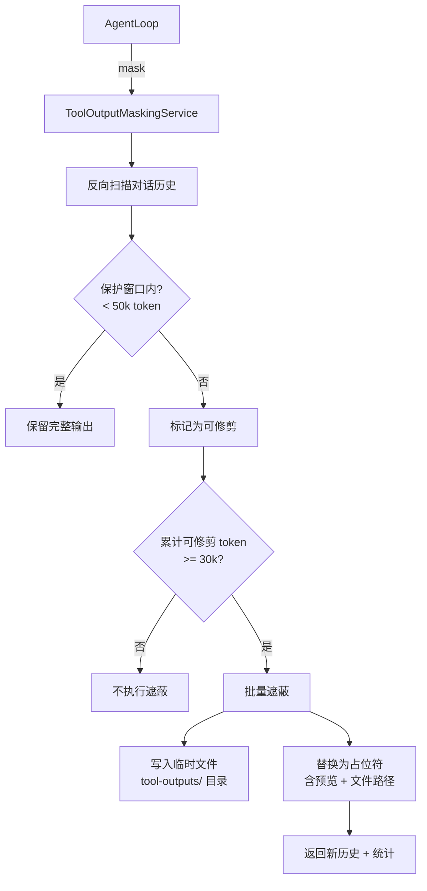

# toolOutputMaskingService.ts

> 工具输出遮蔽服务，通过将大型工具输出替换为摘要占位符来优化上下文窗口使用效率。

## 概述

`ToolOutputMaskingService` 实现了"混合反向扫描 FIFO"算法来管理对话历史中的工具输出大小。当工具（如 Shell 命令）产生大量输出时，该服务会将较旧的大型工具输出写入临时文件，并在对话历史中替换为包含预览信息的轻量占位符。它保护最近的工具输出不被遮蔽（保护窗口默认 50k token），并在可修剪的 token 累计超过阈值（默认 30k token）时批量触发遮蔽，避免频繁的小规模修剪。某些高信号工具（如 `activate_skill`、`memory`、`ask_user` 等）的输出永远不会被遮蔽。

## 架构图

## 主要导出

### 常量
- `DEFAULT_TOOL_PROTECTION_THRESHOLD = 50000`: 保护窗口 token 阈值。
- `DEFAULT_MIN_PRUNABLE_TOKENS_THRESHOLD = 30000`: 最小可修剪 token 阈值。
- `DEFAULT_PROTECT_LATEST_TURN = true`: 是否保护最新一轮。
- `MASKING_INDICATOR_TAG = 'tool_output_masked'`: 遮蔽标识 XML 标签。
- `TOOL_OUTPUTS_DIR = 'tool-outputs'`: 输出存储目录名。

### 接口
- `MaskingResult`: 遮蔽结果（`newHistory` 新历史、`maskedCount` 遮蔽数量、`tokensSaved` 节省的 token 数）。

### `class ToolOutputMaskingService`
- `mask(history: readonly Content[], config: Config): Promise<MaskingResult>` - 执行遮蔽流程。

## 核心逻辑

### 扫描与识别
1. 从对话历史末尾向前扫描（跳过最新一轮，如果 `protectLatestTurn` 为 true）。
2. 仅处理 `functionResponse` 类型的 part（工具输出），跳过已遮蔽的和豁免工具列表中的。
3. 累计工具输出 token，超过保护阈值后，后续的工具输出标记为"可修剪"。

### 批量触发
- 仅当可修剪 token 总量超过 `minPrunableTokensThreshold` 时才执行遮蔽，避免频繁的低效修剪。

### 遮蔽执行
1. 将完整工具输出写入 `tool-outputs/session-{id}/` 目录下的临时文件。
2. 生成摘要占位符，包含：
   - Shell 工具：分段预览（Output 段 head+tail、Exit Code、Error 保留完整）。
   - 其他工具：head 250 字符 + tail 250 字符。
3. 用占位符替换原始 `functionResponse` 的 `response` 字段。
4. 仅在替换后实际节省了 token 时才应用替换。

### 豁免工具
- `activate_skill`、`memory`、`ask_user`、`enter_plan_mode`、`exit_plan_mode` 的输出始终保留。

## 内部依赖

| 模块 | 用途 |
|------|------|
| `../utils/tokenCalculation.js` | `estimateTokenCountSync` token 估算 |
| `../utils/debugLogger.js` | 调试日志 |
| `../utils/fileUtils.js` | `sanitizeFilenamePart` 文件名安全处理 |
| `../config/config.js` | `Config` 配置对象 |
| `../telemetry/loggers.js` | 遥测日志记录 |
| `../telemetry/types.js` | `ToolOutputMaskingEvent` 遥测事件 |
| `../tools/tool-names.js` | 工具名称常量 |

## 外部依赖

| 包 | 用途 |
|----|------|
| `@google/genai` | `Content`, `Part` 类型 |
| `node:path` | 路径处理 |
| `node:fs/promises` | 异步文件操作 |
