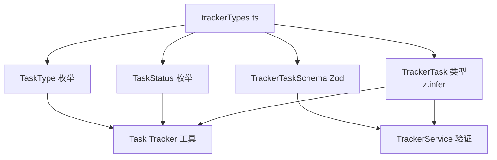

# trackerTypes.ts

> 任务追踪系统的类型定义，包含任务类型、状态枚举和 Zod 验证 schema。

## 概述

`trackerTypes.ts` 定义了任务追踪系统的数据模型，包括任务类型（epic/task/bug）、任务状态（open/in_progress/blocked/closed）、任务数据结构的 Zod 验证 schema 以及从 schema 推导的 TypeScript 类型。该模块在架构中是 `TrackerService` 和任务追踪相关工具的共享类型基础。

## 架构图

## 主要导出

### 枚举
- `TaskType`: 任务类型。
  - `EPIC = 'epic'` - 史诗/大型任务。
  - `TASK = 'task'` - 普通任务。
  - `BUG = 'bug'` - 缺陷。
- `TaskStatus`: 任务状态。
  - `OPEN = 'open'` - 未开始。
  - `IN_PROGRESS = 'in_progress'` - 进行中。
  - `BLOCKED = 'blocked'` - 被阻塞。
  - `CLOSED = 'closed'` - 已完成。

### 常量
- `TASK_TYPE_LABELS`: 任务类型显示标签映射（`[EPIC]`、`[TASK]`、`[BUG]`）。
- `TaskTypeSchema`: 任务类型的 Zod 验证 schema。
- `TaskStatusSchema`: 任务状态的 Zod 验证 schema。
- `TrackerTaskSchema`: 完整任务数据的 Zod 验证 schema，包含以下字段：
  - `id`: 6 字符字符串。
  - `title`: 字符串。
  - `description`: 字符串。
  - `type`: TaskType 枚举。
  - `status`: TaskStatus 枚举。
  - `parentId`: 可选字符串（父任务 ID）。
  - `dependencies`: 字符串数组（依赖任务 ID 列表）。
  - `subagentSessionId`: 可选字符串（子代理会话 ID）。
  - `metadata`: 可选的任意键值对。

### 类型
- `TrackerTask`: 从 `TrackerTaskSchema` 推导的 TypeScript 类型（`z.infer<typeof TrackerTaskSchema>`）。

## 核心逻辑

该模块仅包含类型和枚举定义，不包含业务逻辑。所有 schema 使用 Zod 的 `z.nativeEnum` 和 `z.object` 构建，确保运行时数据验证与 TypeScript 类型保持一致。

## 内部依赖

无。

## 外部依赖

| 包 | 用途 |
|----|------|
| `zod` | 运行时 schema 定义和验证 |
