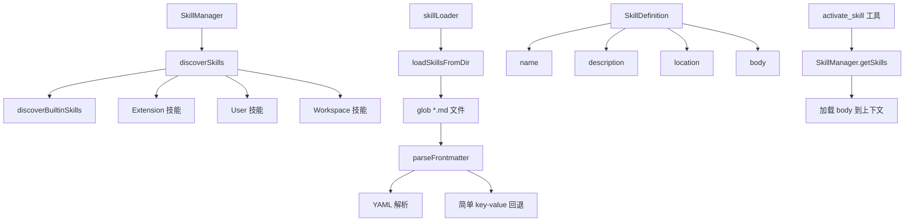

# skills 架构

> 技能系统，管理 Agent 可用技能的发现、加载、注册和生命周期

## 概述

`skills` 模块实现了 Gemini CLI 的技能（Skill）系统。技能是模块化的专业知识包，通过 SKILL.md 文件（YAML frontmatter + Markdown body）定义，可以扩展 Agent 的领域能力。`SkillManager` 按优先级（内置 -> 扩展 -> 用户 -> 工作区）发现和加载技能，`skillLoader` 负责从文件系统读取和解析 SKILL.md 文件。技能通过 `activate_skill` 工具触发，其 body 内容在触发后加载到上下文中。

## 架构图



## 目录结构

```
skills/
├── skillManager.ts    # 技能管理器（发现、注册、查询）
├── skillLoader.ts     # 技能文件加载器（SKILL.md 解析）
└── builtin/           # 内置技能
```

## 关键文件

| 文件 | 功能 |
|------|------|
| `skillManager.ts` | `SkillManager` 类，按四层优先级发现技能（内置 -> 扩展 -> 用户 -> 工作区），高优先级技能覆盖同名低优先级技能。提供 `getSkills`、`findSkillByName`、`isActiveSkill` 等查询方法。工作区技能需要文件夹信任才会加载 |
| `skillLoader.ts` | `loadSkillsFromDir` 函数从目录中扫描 SKILL.md 文件，`parseFrontmatter` 使用 js-yaml 解析 YAML frontmatter（name + description），提取 body 为 Markdown 内容。支持 YAML 失败时回退到简单 key-value 解析 |

## 内部依赖

| 模块 | 用途 |
|------|------|
| `config/storage` | Storage.getUserSkillsDir() 等技能目录路径 |
| `config/config` | GeminiCLIExtension 扩展类型 |
| `utils/debugLogger` | 调试日志 |
| `utils/events` | coreEvents 事件总线 |

## 外部依赖

| 包 | 用途 |
|------|------|
| `glob` | 文件系统模式匹配（扫描 SKILL.md） |
| `js-yaml` | YAML frontmatter 解析 |
