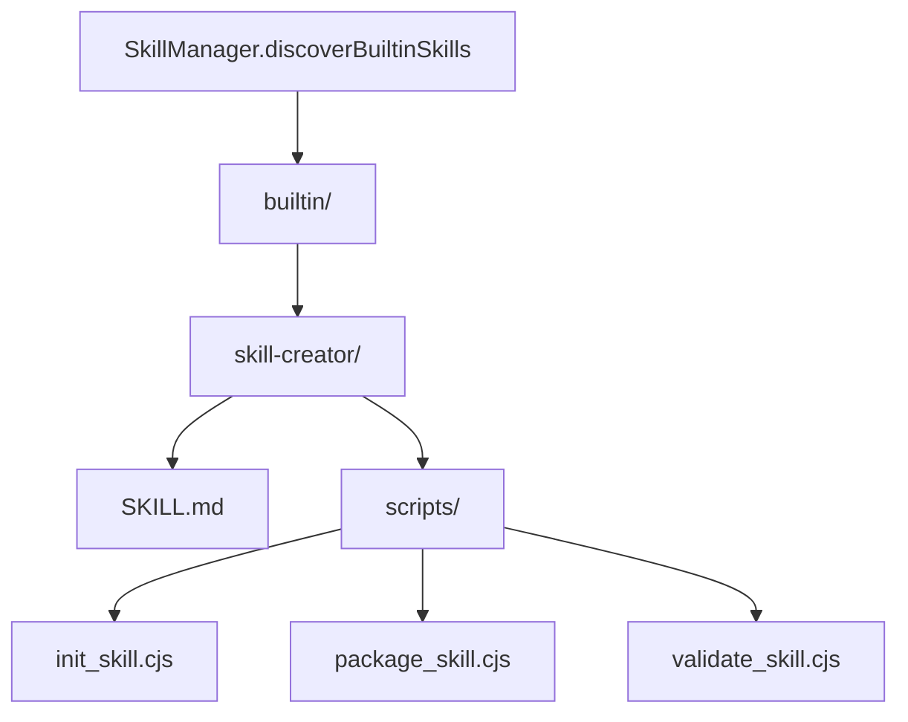

# builtin 架构

> 内置技能目录，包含 Gemini CLI 自带的技能定义

## 概述

`builtin` 目录存放 Gemini CLI 的内置技能（built-in skills）。这些技能随 CLI 一起分发，在技能发现阶段以最低优先级加载（可被用户和工作区技能覆盖）。每个内置技能遵循标准的技能目录结构：包含 SKILL.md 定义文件和可选的 scripts/references/assets 资源目录。目前唯一的内置技能是 `skill-creator`，用于指导用户创建新技能。

## 架构图



## 目录结构

```
builtin/
└── skill-creator/       # 技能创建器（内置技能）
    ├── SKILL.md         # 技能定义和指导文档
    └── scripts/         # 辅助脚本
```

## 关键文件

| 文件 | 功能 |
|------|------|
| `skill-creator/SKILL.md` | 技能创建指南技能定义，提供创建有效技能的完整流程和最佳实践 |

## 内部依赖

内置技能作为数据资源被 `SkillManager` 发现和加载，不直接依赖代码模块。

## 外部依赖

无。内置技能是纯文件资源。
