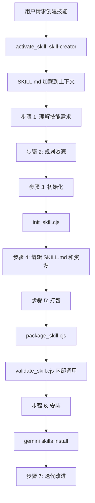

# skill-creator 架构

> 技能创建器，引导用户从零开始创建、验证、打包和安装自定义技能

## 概述

`skill-creator` 是 Gemini CLI 的唯一内置技能，用于指导用户创建新技能或更新现有技能。它提供了完整的技能创建七步流程：理解需求 -> 规划资源 -> 初始化 -> 编辑实现 -> 打包 -> 安装 -> 迭代。技能创建器通过 SKILL.md 中的详细 Markdown 指令（当用户触发 skill-creator 时加载到上下文）来指导 Agent 完成整个创建过程，并提供三个 CJS 辅助脚本来自动化初始化、验证和打包操作。

## 架构图



## 目录结构

```
skill-creator/
├── SKILL.md                    # 技能定义和创建指南
└── scripts/
    ├── init_skill.cjs          # 技能目录初始化脚本
    ├── validate_skill.cjs      # 技能验证脚本
    └── package_skill.cjs       # 技能打包脚本
```

## 关键文件

| 文件 | 功能 |
|------|------|
| `SKILL.md` | 技能创建器的核心指令文档。YAML frontmatter 定义 name 和 description 用于触发识别。Body 包含：技能结构规范（SKILL.md + scripts/ + references/ + assets/）、渐进式披露设计原则、命名约定、七步创建流程详解、最佳实践 |
| `scripts/init_skill.cjs` | CJS 脚本，创建技能目录结构，生成 SKILL.md 模板和示例资源文件。使用方式：`node init_skill.cjs <skill-name> --path <output-dir>` |
| `scripts/package_skill.cjs` | CJS 脚本，将技能打包为 .skill 文件（zip 格式）。打包前自动调用验证，检查 YAML 格式、命名约定、描述质量等 |
| `scripts/validate_skill.cjs` | CJS 脚本，验证技能定义的完整性和规范性 |

## 内部依赖

该技能作为数据资源存在，不直接导入其他代码模块。其脚本通过 `run_shell_command` 工具执行。

## 外部依赖

| 包 | 用途 |
|------|------|
| `node:fs` | 脚本中的文件系统操作 |
| `node:path` | 路径处理 |
