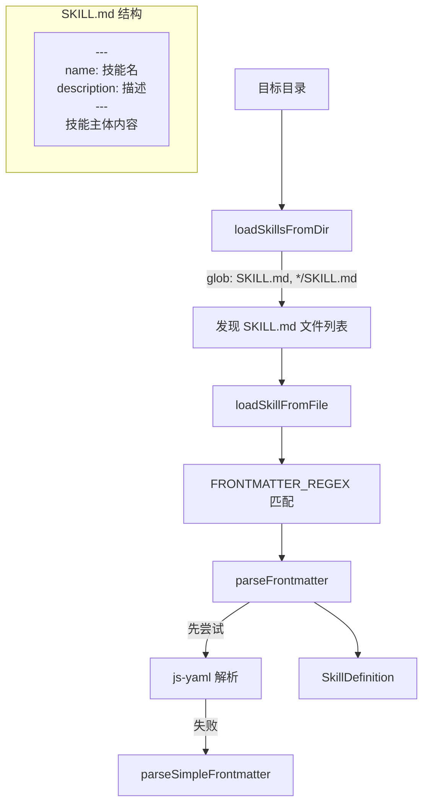

# skillLoader.ts

> 从文件系统发现和加载 SKILL.md 技能文件，解析 YAML 前置元数据。

## 概述

`skillLoader.ts` 负责技能（Skill）的文件系统发现与加载。它扫描指定目录下的 `SKILL.md` 文件（支持根目录和一级子目录），解析其 YAML 前置元数据（frontmatter）中的 `name` 和 `description` 字段，将文件内容解析为 `SkillDefinition` 对象。该文件实现了双层 frontmatter 解析策略：先尝试标准 YAML，失败后回退到简单键值解析器，以兼容包含冒号等特殊字符的描述文本。

## 架构图

## 主要导出

### 接口

- **`SkillDefinition`** — 技能定义：
  - `name: string` -- 技能唯一名称
  - `description: string` -- 技能功能描述
  - `location: string` -- 源文件绝对路径
  - `body: string` -- 技能主体内容（frontmatter 之后的部分）
  - `disabled?: boolean` -- 是否被禁用
  - `isBuiltin?: boolean` -- 是否为内置技能

### 常量

| 常量 | 说明 |
|------|------|
| `FRONTMATTER_REGEX` | 匹配 `---\n...\n---` 前置元数据块的正则表达式 |

### 函数

| 函数 | 签名 | 说明 |
|------|------|------|
| `loadSkillsFromDir` | `(dir: string) => Promise<SkillDefinition[]>` | 扫描目录并加载所有技能 |
| `loadSkillFromFile` | `(filePath: string) => Promise<SkillDefinition \| null>` | 加载单个 SKILL.md 文件 |

## 核心逻辑

1. **目录扫描**：使用 `glob` 库搜索 `SKILL.md` 和 `*/SKILL.md`（支持技能放在子目录中），排除 `node_modules` 和 `.git`。
2. **Frontmatter 解析**：
   - 首先尝试 `js-yaml` 的 `load` 函数标准解析
   - 如果 YAML 解析失败（如描述中包含未引用的冒号），回退到 `parseSimpleFrontmatter` -- 逐行匹配 `name:` 和 `description:` 前缀，支持缩进续行
3. **名称清理**：将技能名中的特殊字符（`:\/<>*?"|`）替换为连字符，确保可用作文件名。
4. **容错设计**：目录不存在、文件读取失败、frontmatter 缺失等情况均返回空数组或 null，不抛出异常。

## 内部依赖

| 模块 | 导入项 | 用途 |
|------|--------|------|
| `../utils/debugLogger.js` | `debugLogger` | 调试日志 |
| `../utils/events.js` | `coreEvents` | 事件通知（警告反馈） |

## 外部依赖

| 包名 | 用途 |
|------|------|
| `node:fs/promises` | 文件系统异步操作 |
| `node:path` | 路径处理 |
| `glob` | 文件 glob 模式匹配 |
| `js-yaml` | YAML 解析 |
