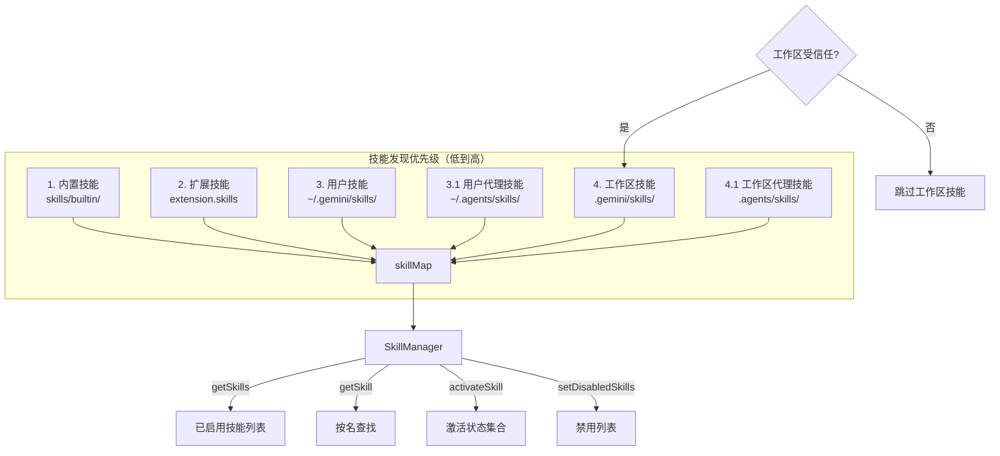

# skillManager.ts

> 技能生命周期管理器，负责发现、注册、优先级覆盖和启用/禁用控制。

## 概述

`skillManager.ts` 实现了 `SkillManager` 类，是技能系统的中央管理器。它协调从多个来源（内置、扩展、用户级、工作区级）发现技能，按优先级规则处理同名冲突，支持管理员启用/禁用控制、技能激活状态追踪等功能。优先级从低到高依次为：内置 -> 扩展 -> 用户 -> 工作区，高优先级来源的技能会覆盖低优先级的同名技能。

## 架构图

## 主要导出

### 类 `SkillManager`

| 方法 | 签名 | 说明 |
|------|------|------|
| `clearSkills` | `() => void` | 清除所有已发现技能 |
| `setAdminSettings` | `(enabled: boolean) => void` | 设置管理员级技能启用/禁用 |
| `isAdminEnabled` | `() => boolean` | 检查管理员是否启用了技能 |
| `discoverSkills` | `(storage, extensions?, isTrusted?) => Promise<void>` | 从所有标准位置发现并加载技能 |
| `addSkills` | `(skills: SkillDefinition[]) => void` | 编程方式添加技能 |
| `getSkills` | `() => SkillDefinition[]` | 获取已启用的技能列表 |
| `getDisplayableSkills` | `() => SkillDefinition[]` | 获取可在 UI 中展示的技能（排除内置） |
| `getAllSkills` | `() => SkillDefinition[]` | 获取所有技能（含禁用） |
| `filterSkills` | `(predicate) => void` | 按谓词过滤技能 |
| `setDisabledSkills` | `(disabledNames: string[]) => void` | 设置禁用技能名称列表 |
| `getSkill` | `(name: string) => SkillDefinition \| null` | 按名称查找技能（忽略大小写） |
| `activateSkill` | `(name: string) => void` | 激活指定技能 |
| `isSkillActive` | `(name: string) => boolean` | 检查技能是否已激活 |

## 核心逻辑

1. **多源发现**：`discoverSkills` 按优先级依次从 6 个来源加载技能：内置目录、扩展、用户 skills 目录、用户 agents/skills 目录、工作区 skills 目录、工作区 agents/skills 目录。
2. **优先级覆盖**：`addSkillsWithPrecedence` 使用 Map 结构，后添加的同名技能会覆盖先添加的。内置技能被覆盖时仅输出 debug 日志，其他冲突输出 warning 反馈。
3. **信任控制**：工作区技能（步骤 4 和 4.1）仅在 `isTrusted = true` 时加载，防止不受信任的项目注入恶意技能。
4. **大小写不敏感**：`getSkill` 和 `setDisabledSkills` 均使用 `toLowerCase()` 进行匹配。
5. **激活追踪**：`activeSkillNames` Set 记录当前会话中被激活的技能，与禁用状态独立。

## 内部依赖

| 模块 | 导入项 | 用途 |
|------|--------|------|
| `../config/storage.js` | `Storage` | 获取标准目录路径 |
| `./skillLoader.js` | `SkillDefinition`, `loadSkillsFromDir` | 技能加载功能 |
| `../config/config.js` | `GeminiCLIExtension` (type) | 扩展类型 |
| `../utils/debugLogger.js` | `debugLogger` | 调试日志 |
| `../utils/events.js` | `coreEvents` | 事件通知 |

## 外部依赖

| 包名 | 用途 |
|------|------|
| `node:path` | 路径处理 |
| `node:url` | `fileURLToPath` 获取当前文件目录 |
