# telemetry 架构

> 遥测系统，提供结构化日志、指标收集、追踪和性能监控的统一框架

## 概述

`telemetry` 模块是 Gemini CLI 的可观测性基础设施，基于 OpenTelemetry SDK 构建，提供三大支柱：日志（Logs）、指标（Metrics）和追踪（Traces）。模块支持多种导出目标（GCP、本地文件），涵盖丰富的事件类型（会话启动、用户提示、API 请求/响应、工具调用、模型路由、扩展操作等），并包含活跃度检测、内存监控、速率限制、启动性能分析等高级功能。所有遥测数据在发送前经过脱敏处理。

## 架构图

```mermaid
graph TD
    A[sdk.ts 初始化] --> B[OpenTelemetry SDK]
    B --> C[Logs Provider]
    B --> D[Metrics Provider]
    B --> E[Trace Provider]

    F[loggers.ts] --> G[事件日志函数]
    G --> H[logUserPrompt]
    G --> I[logToolCall]
    G --> J[logApiRequest/Response]
    G --> K[logModelRouting]

    L[metrics.ts] --> M[指标记录函数]
    M --> N[recordToolCallMetrics]
    M --> O[recordTokenUsageMetrics]
    M --> P[recordMemoryUsage]

    Q[trace.ts] --> R[runInDevTraceSpan]

    S[导出器] --> T[gcp-exporters.ts]
    S --> U[file-exporters.ts]
    S --> V[clearcut-logger/]

    W[监控] --> X[memory-monitor.ts]
    W --> Y[activity-monitor.ts]
    W --> Z[startupProfiler.ts]

    AA[config.ts] --> BB[resolveTelemetrySettings]
    CC[sanitize.ts] --> DD[遥测数据脱敏]
```



## 目录结构

```
telemetry/
├── index.ts                    # 模块导出入口
├── sdk.ts                      # OpenTelemetry SDK 初始化/关闭
├── config.ts                   # 遥测配置解析
├── loggers.ts                  # 结构化事件日志函数
├── metrics.ts                  # 指标收集函数
├── trace.ts                    # 追踪 Span 管理
├── types.ts                    # 事件类型定义
├── constants.ts                # 常量定义
├── semantic.ts                 # 语义约定
├── telemetryAttributes.ts      # 遥测属性
├── sanitize.ts                 # 数据脱敏
├── llmRole.ts                  # LLM 角色枚举
├── tool-call-decision.ts       # 工具调用决策遥测
├── telemetry-utils.ts          # 遥测工具函数
├── gcp-exporters.ts            # GCP 导出器
├── file-exporters.ts           # 文件导出器
├── conseca-logger.ts           # Conseca 安全检查日志
├── billingEvents.ts            # 计费事件
├── uiTelemetry.ts              # UI 遥测事件
├── rate-limiter.ts             # 速率限制器
├── memory-monitor.ts           # 内存监控
├── activity-detector.ts        # 活跃度检测
├── activity-monitor.ts         # 活跃度监控
├── activity-types.ts           # 活跃度类型
├── high-water-mark-tracker.ts  # 高水位标记追踪
├── startupProfiler.ts          # 启动性能分析
└── clearcut-logger/            # Clearcut 日志子系统
```

## 关键文件

| 文件 | 功能 |
|------|------|
| `index.ts` | 统一导出入口，暴露所有公共 API（初始化函数、日志函数、指标函数、事件类型、监控类等） |
| `sdk.ts` | `initializeTelemetry` 初始化 OpenTelemetry SDK（配置 providers/exporters），`shutdownTelemetry`/`flushTelemetry` 生命周期管理 |
| `loggers.ts` | 事件日志函数集合：logCliConfiguration, logUserPrompt, logToolCall, logApiRequest, logApiResponse, logApiError, logModelRouting, logConversationFinishedEvent 等 |
| `metrics.ts` | 指标记录函数集合：recordToolCallMetrics, recordTokenUsageMetrics, recordApiResponseMetrics, recordMemoryUsage, recordStartupPerformance 等，支持 OpenTelemetry GenAI 语义约定 |
| `types.ts` | 遥测事件类类型定义：StartSessionEvent, UserPromptEvent, ToolCallEvent, ApiRequestEvent, ApiResponseEvent, ModelRoutingEvent 等几十种事件 |
| `trace.ts` | `runInDevTraceSpan` 在开发模式下创建追踪 Span 包裹异步操作 |
| `config.ts` | `resolveTelemetrySettings` 从环境变量和配置解析遥测设置（target, endpoint, enabled 等） |
| `memory-monitor.ts` | `MemoryMonitor` 定期采集进程内存快照，记录 RSS/堆使用量 |
| `activity-detector.ts` | `ActivityDetector` 检测用户活动状态（键盘/鼠标输入） |
| `startupProfiler.ts` | `StartupProfiler` 跟踪 CLI 启动各阶段的耗时 |

## 内部依赖

| 模块 | 用途 |
|------|------|
| `config/config` | Config 配置（模型、会话信息） |
| `utils/debugLogger` | 调试日志 |
| `utils/events` | coreEvents 事件 |

## 外部依赖

| 包 | 用途 |
|------|------|
| `@opentelemetry/api` | OpenTelemetry API（Span, Meter, Logger） |
| `@opentelemetry/sdk-node` | OpenTelemetry Node.js SDK |
| `@opentelemetry/semantic-conventions` | 语义约定常量 |
| `systeminformation` | 系统信息采集 |
| `https-proxy-agent` | HTTP 代理支持 |
