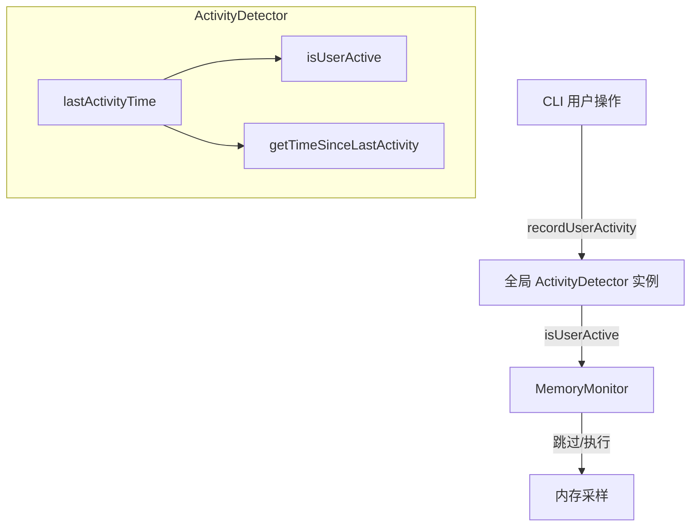

# activity-detector.ts

> 用户活动状态检测器，用于判断用户是否处于空闲状态

## 概述
该文件实现了一个用户活动检测器（`ActivityDetector`），通过追踪最近一次用户交互的时间戳来判断用户当前是否活跃。主要用于内存监控系统，在用户空闲时跳过不必要的内存采样，从而降低性能开销。文件同时提供了一个全局单例实例和便捷函数，供 CLI 各处直接调用。

## 架构图

## 主要导出

### `class ActivityDetector`
活动检测器类。
- **constructor(idleThresholdMs?: number)**: 构造函数，默认空闲阈值 30 秒。
- **recordActivity(): void**: 记录用户活动，更新最后活动时间。
- **isUserActive(): boolean**: 判断用户是否活跃（距最后活动时间是否在阈值内）。
- **getTimeSinceLastActivity(): number**: 返回距最后一次活动的毫秒数。
- **getLastActivityTime(): number**: 返回最后活动的时间戳。

### `function getActivityDetector(): ActivityDetector`
获取全局单例 `ActivityDetector` 实例。

### `function recordUserActivity(): void`
便捷函数，在全局实例上记录用户活动。

### `function isUserActive(): boolean`
便捷函数，检查用户是否活跃。

## 核心逻辑
1. 通过 `Date.now()` 记录最后一次用户活动的时间戳。
2. `isUserActive()` 将当前时间与最后活动时间的差值与 `idleThresholdMs` 比较，小于阈值则认为用户活跃。
3. 全局实例 `globalActivityDetector` 在模块加载时即被创建（饿汉模式），使用默认 30 秒阈值。

## 内部依赖
无（纯独立模块）

## 外部依赖
无
