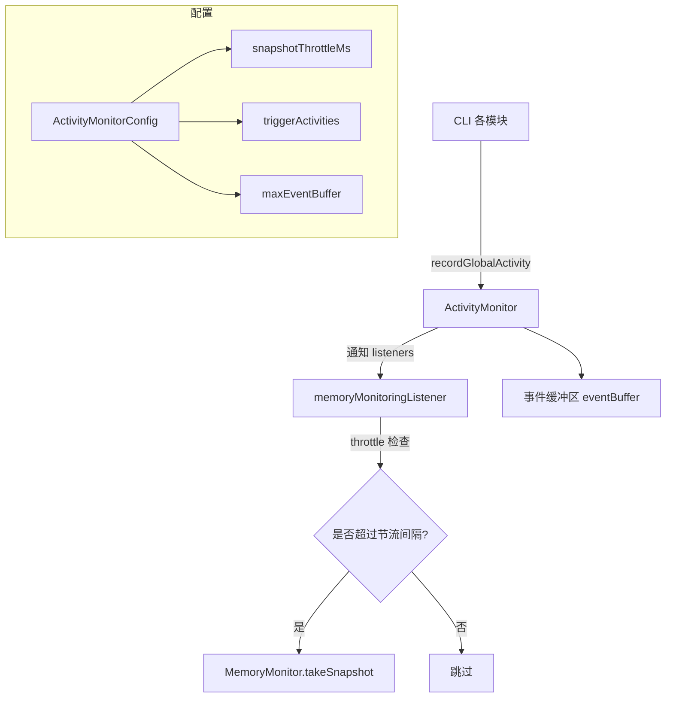

# activity-monitor.ts

> 用户活动监控器，追踪用户操作事件并触发内存快照采集

## 概述
`ActivityMonitor` 是用户活动事件的中央监听/分发枢纽。它接收来自 CLI 各处上报的活动事件（如用户输入、消息添加、工具调用等），通过事件缓冲区管理和监听器通知机制，将关键活动事件与内存监控系统关联起来。当特定活动类型发生时，自动触发内存快照采集，同时通过节流机制避免频繁采样。

## 架构图

## 主要导出

### `interface ActivityEvent`
活动事件数据结构，包含 `type`、`timestamp`、`context`、`metadata`。

### `interface ActivityMonitorConfig`
活动监控配置，含 `enabled`、`snapshotThrottleMs`、`maxEventBuffer`、`triggerActivities`。

### `type ActivityListener`
活动监听器回调类型 `(event: ActivityEvent) => void`。

### `const DEFAULT_ACTIVITY_CONFIG`
默认配置：节流间隔 1 秒，缓冲区上限 100，触发活动类型包括用户输入开始、消息添加、工具调用调度、流开始。

### `class ActivityMonitor`
核心类。方法包括：
- **start(coreConfig: Config): void**: 启动监控，注册内存监控监听器。
- **stop(): void**: 停止监控，清理资源。
- **addListener / removeListener**: 管理监听器。
- **recordActivity(type, context?, metadata?): void**: 记录活动事件，通知所有监听器。
- **getRecentActivity(limit?): ActivityEvent[]**: 获取最近的活动事件。
- **getActivityStats()**: 获取活动统计数据。

### 全局便捷函数
- `initializeActivityMonitor(config?)`
- `getActivityMonitor()`
- `recordGlobalActivity(type, context?, metadata?)`
- `startGlobalActivityMonitoring(coreConfig, activityConfig?)`
- `stopGlobalActivityMonitoring()`

## 核心逻辑
1. 活动事件写入环形缓冲区（超出 `maxEventBuffer` 时移除最早事件）。
2. 通知所有注册的监听器，监听器错误会被静默捕获。
3. 内存监控监听器仅在事件类型命中 `triggerActivities` 列表且超过节流间隔时才触发 `MemoryMonitor.takeSnapshot`。

## 内部依赖
- `./metrics.js` — `isPerformanceMonitoringActive()`
- `./memory-monitor.js` — `getMemoryMonitor()`
- `./activity-types.js` — `ActivityType`
- `../config/config.js` — `Config`
- `../utils/debugLogger.js` — `debugLogger`

## 外部依赖
无
