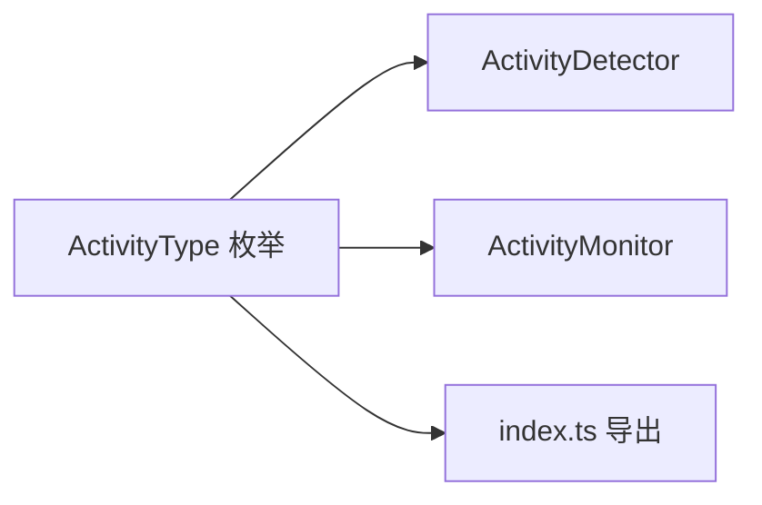

# activity-types.ts

> 定义可追踪的用户活动类型枚举

## 概述
该文件定义了 `ActivityType` 枚举，列出了所有可被活动监控系统追踪的用户活动类型。它作为活动检测和活动监控模块之间的共享类型契约，确保事件类型的一致性。

## 架构图

## 主要导出

### `enum ActivityType`
| 值 | 含义 |
|---|---|
| `USER_INPUT_START` | 用户输入开始 |
| `USER_INPUT_END` | 用户输入结束 |
| `MESSAGE_ADDED` | 消息已添加 |
| `TOOL_CALL_SCHEDULED` | 工具调用已调度 |
| `TOOL_CALL_COMPLETED` | 工具调用已完成 |
| `STREAM_START` | 流式响应开始 |
| `STREAM_END` | 流式响应结束 |
| `HISTORY_UPDATED` | 历史记录已更新 |
| `MANUAL_TRIGGER` | 手动触发 |

## 核心逻辑
纯类型定义文件，无运行时逻辑。

## 内部依赖
无

## 外部依赖
无
