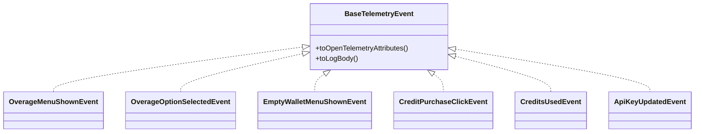

# billingEvents.ts

> 定义计费相关的遥测事件类（超额菜单、额度购买、积分消耗等）

## 概述
该文件定义了与 AI 积分 / 计费系统相关的所有遥测事件类。每个事件类实现了 `BaseTelemetryEvent` 接口，可序列化为 OpenTelemetry 日志属性和人类可读的日志文本。涵盖超额菜单展示、超额选项选择、空钱包菜单展示、积分购买点击和积分消耗等场景。

## 架构图

## 主要导出

### `type OverageOption`
超额菜单选项联合类型：`'use_credits' | 'use_fallback' | 'manage' | 'stop' | 'get_credits'`

### `class OverageMenuShownEvent`
超额菜单展示事件，记录模型、积分余额和超额策略。

### `class OverageOptionSelectedEvent`
超额选项选择事件，记录用户选择了哪个选项。

### `class EmptyWalletMenuShownEvent`
空钱包菜单展示事件。

### `class CreditPurchaseClickEvent`
积分购买点击事件，记录来源（超额菜单 / 空钱包菜单 / 管理）。

### `class CreditsUsedEvent`
积分消耗事件，记录消耗量和剩余量。

### `class ApiKeyUpdatedEvent`
API 密钥（认证类型）变更事件。

### `type BillingTelemetryEvent`
所有计费遥测事件的联合类型。

## 核心逻辑
每个事件类的 `toOpenTelemetryAttributes(config)` 方法会合并公共属性（`getCommonAttributes`）和事件专属字段，生成 OpenTelemetry 日志属性对象。

## 内部依赖
- `./types.js` — `BaseTelemetryEvent`
- `./telemetryAttributes.js` — `getCommonAttributes`
- `../config/config.js` — `Config`
- `../billing/billing.js` — `OverageStrategy`

## 外部依赖
- `@opentelemetry/api-logs` — `LogAttributes`
