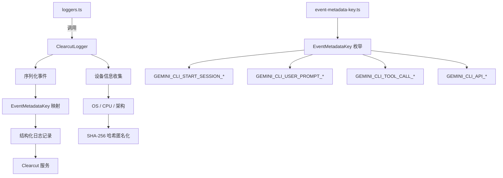

# clearcut-logger 架构

> Clearcut 日志系统，将遥测事件序列化为结构化日志记录并上报到 Google Clearcut 服务

## 概述

`clearcut-logger` 子模块实现了将 Gemini CLI 遥测事件序列化并上报到 Google Clearcut（Google 内部日志分析服务）的功能。`ClearcutLogger` 类负责将各种事件类型（会话启动、用户提示、API 请求、工具调用等数十种事件）转换为以 `EventMetadataKey` 枚举为键的结构化日志记录。它还收集设备指纹信息（OS、CPU 架构等的哈希值）用于匿名化的使用分析。

## 架构图



## 目录结构

```
clearcut-logger/
├── clearcut-logger.ts      # ClearcutLogger 主类
└── event-metadata-key.ts   # 事件元数据键枚举定义
```

## 关键文件

| 文件 | 功能 |
|------|------|
| `clearcut-logger.ts` | `ClearcutLogger` 类，为每种遥测事件类型提供序列化方法，将事件数据转换为 EventMetadataKey 键值对格式。收集匿名化的设备指纹（通过 systeminformation 获取 OS、CPU 信息并 SHA-256 哈希），支持 HTTP 代理 |
| `event-metadata-key.ts` | `EventMetadataKey` 枚举，定义所有可能的日志键（约 190+ 个），按事件类别分组：Start Session、User Prompt、Tool Call、API Request/Response/Error、Model Routing、Extension、Agent、Billing 等 |

## 内部依赖

| 模块 | 用途 |
|------|------|
| `telemetry/types` | 所有遥测事件类型（StartSessionEvent, ToolCallEvent 等） |
| `telemetry/billingEvents` | 计费相关事件类型 |

## 外部依赖

| 包 | 用途 |
|------|------|
| `node:crypto` | createHash 用于设备指纹哈希 |
| `node:os` | 操作系统信息 |
| `systeminformation` | 详细系统信息（CPU、板卡等） |
| `https-proxy-agent` | HTTP 代理支持 |
