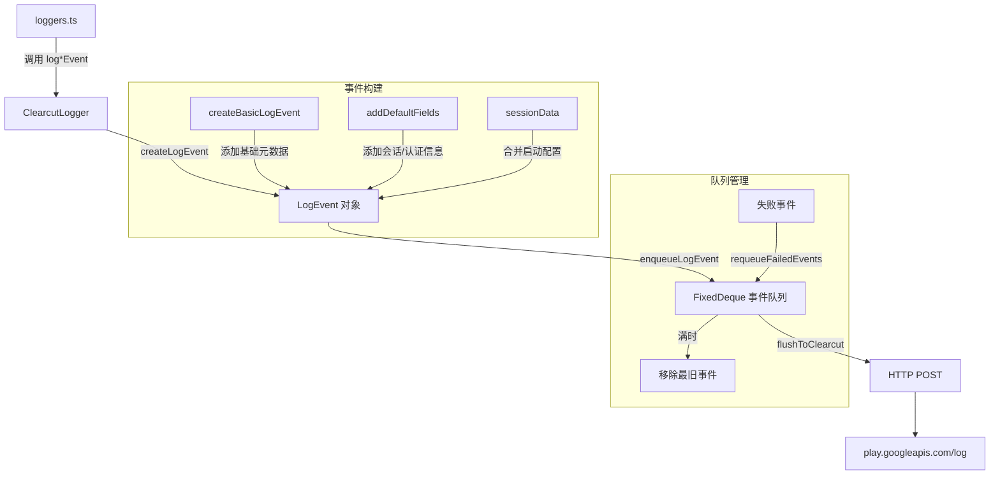

# clearcut-logger.ts

> Google Clearcut 日志系统客户端，批量缓冲并发送遥测事件到 Google 日志收集服务

## 概述
`ClearcutLogger` 是一个单例类，负责将 Gemini CLI 的遥测事件以结构化格式批量发送到 Google 的 Clearcut 日志收集服务（`play.googleapis.com/log`）。它维护一个固定容量的事件队列（FixedDeque），按 60 秒间隔自动刷新，支持失败重试和代理配置。该类为每种事件类型提供专门的日志方法，将事件数据转换为 Clearcut 协议所需的 `EventValue[]` 键值对格式。

## 架构图

## 主要导出

### `enum EventNames`
所有支持的事件名称枚举（~50 种），如 `START_SESSION`, `NEW_PROMPT`, `TOOL_CALL`, `API_RESPONSE` 等。

### 协议接口
- **`LogResponse`**: 服务端响应（含 `nextRequestWaitMs`）。
- **`LogEventEntry`**: 单条日志条目（时间戳 + JSON 序列化的事件 + 可选实验 ID）。
- **`EventValue`**: 键值对（`gemini_cli_key` + `value`）。
- **`LogEvent`**: 完整的日志事件（console_type, application, event_name, event_metadata, client_email/install_id）。
- **`LogRequest`**: 发送到 Clearcut 的请求体。

### `class ClearcutLogger`
**生命周期方法：**
- **static getInstance(config?)**: 获取/创建单例。仅在 `usageStatisticsEnabled` 为 true 时创建。
- **shutdown()**: 发送结束会话事件并刷新。

**事件日志方法（~40 个）：**
- `logStartSessionEvent(event)`: 异步，收集硬件信息（CPU、RAM、GPU），等待实验加载后发送。
- `logNewPromptEvent`, `logToolCallEvent`, `logFileOperationEvent`
- `logApiRequestEvent`, `logApiResponseEvent`, `logApiErrorEvent`
- `logFlashFallbackEvent`, `logRipgrepFallbackEvent`
- `logLoopDetectedEvent`, `logNextSpeakerCheck`, `logSlashCommandEvent`
- `logRewindEvent`, `logChatCompressionEvent`, `logConversationFinishedEvent`
- `logExtensionInstallEvent`, `logExtensionUninstallEvent`, `logExtensionUpdateEvent`, `logExtensionEnableEvent`, `logExtensionDisableEvent`
- `logModelRoutingEvent`, `logModelSlashCommandEvent`
- `logEditStrategyEvent`, `logEditCorrectionEvent`
- `logAgentStartEvent`, `logAgentFinishEvent`, `logRecoveryAttemptEvent`
- `logWebFetchFallbackAttemptEvent`, `logLlmLoopCheckEvent`
- `logHookCallEvent`, `logApprovalModeSwitchEvent`, `logApprovalModeDurationEvent`
- `logPlanExecutionEvent`, `logToolOutputTruncatedEvent`, `logToolOutputMaskingEvent`
- `logKeychainAvailabilityEvent`, `logTokenStorageInitializationEvent`
- `logStartupStatsEvent`
- `logCreditsUsedEvent`, `logOverageOptionSelectedEvent`, `logEmptyWalletMenuShownEvent`, `logCreditPurchaseClickEvent`

**队列管理方法：**
- `enqueueLogEvent(event)`: 入队日志事件。
- `enqueueLogEventAfterExperimentsLoadAsync(event)`: 等待实验加载后入队。
- `createLogEvent(eventName, data?)`: 创建包含会话数据和默认字段的完整日志事件。
- `createBasicLogEvent(eventName, data?)`: 创建仅含基础元数据的日志事件。
- `flushIfNeeded()`: 检查是否到达刷新间隔并触发刷新。
- `flushToClearcut()`: 执行 HTTP POST 发送所有缓冲事件。

## 核心逻辑

### 事件构建
1. `createBasicLogEvent` 添加基础元数据：surface（运行环境）、CLI 版本、Git commit、OS、GitHub Actions 相关信息。
2. `createLogEvent` 在基础事件上追加：session ID、auth type、prompt ID、Node 版本、用户设置、实验 ID 等。
3. 用户标识选择：有 Google 邮箱时用 `client_email`，否则用匿名的 `client_install_id`。

### 队列管理
- 使用 `FixedDeque`（固定容量双端队列，最多 1000 条）存储待发送事件。
- 队列满时自动移除最旧事件（FIFO 淘汰）。
- 发送失败时将事件重新入队（最多 100 条），优先保留最近的事件。

### 刷新策略
- 每 60 秒自动检查一次（`flushIfNeeded`）。
- 某些关键事件（如 `START_SESSION`、`END_SESSION`）会立即触发刷新。
- 使用 `flushing` 和 `pendingFlush` 标志防止并发刷新。

### Surface 检测
`determineSurface()` 根据环境变量判断运行环境：`SURFACE` 环境变量 > Cloud Shell > GitHub Actions > VS Code > 默认。

### GPU 信息
通过 `systeminformation` 库异步获取 GPU 型号信息，结果缓存以避免重复查询。

## 内部依赖
- `../types.js` — 所有事件类型
- `../billingEvents.js` — 计费事件类型
- `./event-metadata-key.js` — `EventMetadataKey`
- `../../config/config.js` — `Config`
- `../../utils/installationManager.js` — `InstallationManager`
- `../../utils/userAccountManager.js` — `UserAccountManager`
- `../../utils/safeJsonStringify.js`
- `../../tools/tool-names.js` — `ASK_USER_TOOL_NAME`
- `../../generated/git-commit.js` — `GIT_COMMIT_INFO`, `CLI_VERSION`
- `../../ide/detect-ide.js` — IDE 检测
- `../../utils/debugLogger.js`
- `../../utils/errors.js` — `getErrorMessage`

## 外部依赖
- `node:crypto` — `createHash`（GitHub 仓库名 SHA-256 哈希）
- `node:os` — CPU、RAM 信息
- `systeminformation` — GPU 信息
- `https-proxy-agent` — HTTP 代理支持
- `mnemonist` — `FixedDeque`（固定容量双端队列）
