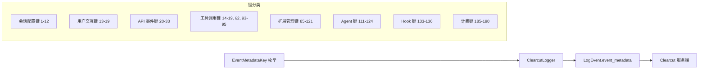

# event-metadata-key.ts

> 定义 Clearcut 日志事件的元数据键枚举（~190 个键）

## 概述
该文件定义了 `EventMetadataKey` 枚举，包含所有可在 Clearcut 日志事件中使用的元数据键。每个键对应一个数值 ID，用于结构化地标识事件中的各个字段。这些键覆盖了会话配置、用户提示、工具调用、API 请求/响应、文件操作、扩展管理、循环检测、Agent 运行、Hook 调用、审批模式、计费等所有遥测维度。

## 架构图

## 主要导出

### `enum EventMetadataKey`
每个键名以 `GEMINI_CLI_` 前缀开头，赋予唯一数字 ID。主要分组：

**会话配置 (1-12, 63-65, 94, 119-120)**
- `GEMINI_CLI_START_SESSION_MODEL` (1) — 模型 ID
- `GEMINI_CLI_START_SESSION_SANDBOX` (3) — 沙箱状态
- `GEMINI_CLI_START_SESSION_APPROVAL_MODE` (5) — 审批模式
- `GEMINI_CLI_START_SESSION_MCP_SERVERS_COUNT` (63) — MCP 服务器数量
- `GEMINI_CLI_START_SESSION_EXTENSIONS_COUNT` (119) — 扩展数量

**启动统计 (172-175)**
- `GEMINI_CLI_STARTUP_PHASES` (172) — 启动阶段数据

**用户提示 (13)**
- `GEMINI_CLI_USER_PROMPT_LENGTH` (13) — 提示长度

**工具调用 (14-19, 47-50, 62, 93-95, 103-106)**
- `GEMINI_CLI_TOOL_CALL_NAME` (14) — 工具名
- `GEMINI_CLI_TOOL_CALL_DECISION` (15) — 用户决策
- `GEMINI_CLI_AI_ADDED_LINES` (47) — AI 添加行数
- `GEMINI_CLI_TOOL_TYPE` (62) — 工具类型（mcp/native）

**API 事件 (20-33)**
- `GEMINI_CLI_API_RESPONSE_INPUT_TOKEN_COUNT` (25)
- `GEMINI_CLI_API_RESPONSE_OUTPUT_TOKEN_COUNT` (26)
- 上下文分解键 (167-171)

**共享键 (35-40, 54-55, 82-84, 125, 130-132, 176-179)**
- `GEMINI_CLI_SESSION_ID` (40)
- `GEMINI_CLI_VERSION` (54)
- `GEMINI_CLI_EXPERIMENT_IDS` (131)
- `GEMINI_CLI_GH_WORKFLOW_NAME` (130) — GitHub Actions

**扩展 (85-88, 96, 102, 107, 117-121)**
- `GEMINI_CLI_EXTENSION_ID` (121)
- `GEMINI_CLI_EXTENSION_INSTALL_STATUS` (88)

**模型路由 (97-101, 108, 145-147)**
- `GEMINI_CLI_ROUTING_DECISION` (97)
- `GEMINI_CLI_ROUTING_LATENCY_MS` (99)

**Agent (111-115, 122-124)**
- `GEMINI_CLI_AGENT_NAME` (111)
- `GEMINI_CLI_AGENT_DURATION_MS` (113)

**Conseca (159-166)**
- `CONSECA_GENERATED_POLICY` (161)
- `CONSECA_VERDICT_RESULT` (162)

**计费 (185-190)**
- `GEMINI_CLI_BILLING_CREDITS_CONSUMED` (186)
- `GEMINI_CLI_BILLING_CREDITS_REMAINING` (187)

## 核心逻辑
纯枚举定义文件，无运行时逻辑。已删除 24 个废弃键，下一个可用 ID 为 191。

## 内部依赖
无

## 外部依赖
无
