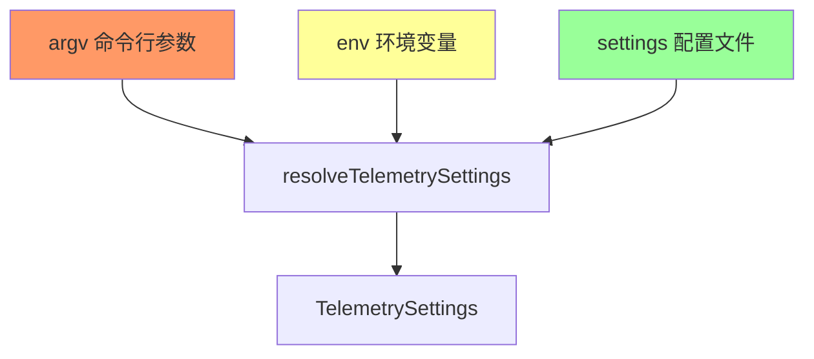

# config.ts

> 解析和合并遥测配置，按优先级从命令行参数、环境变量、配置文件中解析遥测设置

## 概述
该文件负责将遥测相关的配置项从多个来源（命令行参数最高优先级、环境变量次之、settings 文件最低）进行合并解析，生成最终的 `TelemetrySettings` 对象。同时提供了布尔值环境变量解析和遥测目标类型解析的工具函数。

## 架构图

## 主要导出

### `function parseBooleanEnvFlag(value: string | undefined): boolean | undefined`
将字符串 `'true'` / `'1'` 解析为 `true`，其余为 `false`，`undefined` 保持原样。

### `function parseTelemetryTargetValue(value): TelemetryTarget | undefined`
将字符串或 TelemetryTarget 值归一化为 `TelemetryTarget.LOCAL` 或 `TelemetryTarget.GCP`。

### `interface TelemetryArgOverrides`
命令行参数覆盖接口，含 `telemetry`、`telemetryTarget`、`telemetryOtlpEndpoint` 等字段。

### `async function resolveTelemetrySettings(options): Promise<TelemetrySettings>`
核心函数，按 argv > env > settings 优先级合并以下配置项：
- `enabled` — 是否启用遥测
- `target` — 遥测目标（local / gcp）
- `otlpEndpoint` — OTLP 端点
- `otlpProtocol` — OTLP 协议（grpc / http）
- `logPrompts` — 是否记录用户提示
- `outfile` — 输出文件路径
- `useCollector` — 是否使用收集器
- `useCliAuth` — 是否使用 CLI 认证

## 核心逻辑
对于每个配置项，按 argv -> env -> settings 的顺序查找第一个非 `undefined` 的值。对无效的 `target` 和 `otlpProtocol` 会抛出 `FatalConfigError`。

## 内部依赖
- `../config/config.js` — `TelemetrySettings`
- `../utils/errors.js` — `FatalConfigError`
- `./index.js` — `TelemetryTarget`

## 外部依赖
无
